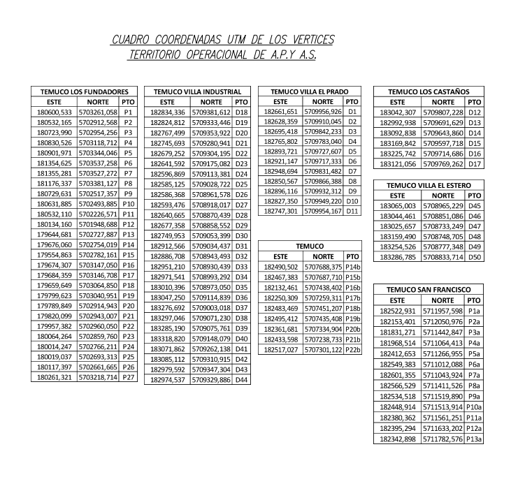

# metodologia

## bibliografia

1. [HACER VISIBLE: LA CONTRIBUCIÓN DE LA ARQUITECTURA FORENSE PARA LA LECTURA DE LOS EVENTOS CONTEMPORÁNEOS Y LA EXPERIENCIA LATINOAMERICANA](https://revistas.ulima.edu.pe/index.php/Limaq/article/view/6582/6845)

# zonas

## La pileta de los patos chinos, Avda. Balmaceda / Biblioteca Galo Sepúlveda

Vista parque, pileta cuadrada y en los costados una escalera de tres peldaños. Senderos rodeados de pasto. Un busto en altura de perfil al centro de los pastos. https://culturadigital.udp.cl/index.php/fotografia/chile-temuco-av-balmaceda/

### acciones posibles

1. elevacion 1:1 pileta (pre estudio > buscar planos en municipio, OOPP)
2. medicion volumetrica del agua
3. identificacion de flora y fauna circundante / microscopia de no humanidades
4. diagrama de humedad relativa
5. replica material de componentes
6. catalogo botanico

## Sistema de agua potable de Temuco

1. piscina vacia en el borde del ñielol
2. 

### bibliografia

1. [ESTUDIO DE FACTIBILIDAD PARA AMPLIAR O DOTAR DE AGUA POTABLE Y ALCANTARILLADO DE AGUAS SERVIDAS, EN RELACION CON EL CRECIMIENTO URBANO PROYECTADO](https://www.temuco.cl/wp-content/uploads/2022/04/EST-Factibilidad-Sanitaria.pdf)
2. socavones con agua en la cancha atrás del gimnasio olímpico
3. antiguo canal en calle matta
4. Ojo de Agua a la orilla del puente nuevo
5. Ojos de agua detrás de la cancha de amanecer

Sacar el rollo > > > > >
7. estero temuco, Pedro de valdivia
8. Canal que recorre calle Caupolican
9. cegamiento de canal calle las Heras desde Montt, se deseaba abovedar el canal, canal que recoge derrames de la ciudad. La solución temporal es cerrar el canal de las Heras con una especie de compuerta y llevar sus aguas al canal de Caupolicán
10. Canal tapado con tapas de madera en calle prieto
11. laguna los patos el carmen
12.

1. presentar requerimiento de transparencia de la municipalidad respecto a la situacion de la pileta enterrada e balmaceda, tras las obras de mejoramiento urbano del año pasado.
2. _En el ASP no existen cursos de agua regulares, salvo pequeñas vertientes naturales de poco caudal. Las más importantes son las denominadas Antonio Coñoepan y Agua Santa. Cabe destacar la presencia del canal Gibbs, que recorre gran parte del límite sur del ASP y que además lleva un importante caudal de 1000 a 1200 litros por segundo. Este cuerpo de agua abastecía de agua potable a parte de la población de Temuco._
3. _El Monumento Natural Cerro Ñielol (M.N. Cerro Ñielol) es una de las 106 áreas silvestres protegidas (ASP) del Estado._
4. _En el año 2023 investigadores de la Universidad Católica de Temuco realizaron un estudio respecto a las flores exóticas en áreas protegidas del país. Tomaron en cuenta los registros realizados a lo largo de los años por otros investigadores para determinar la riqueza de estas especies y el índice de invasibilidad en estas áreas. El resultado fue que el ASP con mayor riqueza de especies exóticas en comparación a la al total de especies en el área es el Cerro Ñielol con un 39,2% de especies exóticas, seguido por PN Torres del Paine (32%) y RN Lago Peñuelas (27,5%). Mientras que el índice de invasibilidad, es decir, cuan expuesta está el ASP de ser invadida por especies exóticas, también concluyó que el área protegida más afectada es el cerro Ñielol, con 93 plantas invasoras en una superficie de sólo 89 hectáreas. La obtención de estos resultados se puede deber a diversas causas, como el número excesivo de visitantes al MN Cerro Ñielol, que ha aumentado en los últimos años, y destruye parte del sotobosque, permitiendo la invasión de tales especies (malezas). Y la cercanía de la ciudad al Monumento, lo que permite mayor accesibilidad a especies exóticas tanto de flora como fauna._

---

###### TERRITORIO OPERACIONAL PLANTA GENERAL AGUAS ARAUCANIA

---

https://www.fcjs.unl.edu.ar/cursosvirtuales/la-interdisciplina-forense-conceptos-introductorios/
https://revistas.ulima.edu.pe/index.php/Limaq/article/view/6582/6845
https://www.temuco.cl/wp-content/uploads/2022/04/EST-Factibilidad-Sanitaria.pdf
https://www.temuco.cl/wp-content/uploads/2022/04/Cap7-Ambiental.pdf
https://www.temuco.cl/wp-content/uploads/2022/04/planregulador_Antecedentes-inicio-EAE.pdf
https://comunicacionysociedad.cucsh.udg.mx/index.php/comsoc/article/view/6840/0?articlesBySimilarityPage=3
https://www.doctoradoencomunicacion.cl/comunicacion-indisciplinada/
https://interytransdisciplina.ufro.cl/proyecto/
