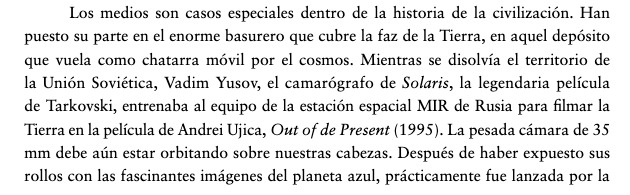
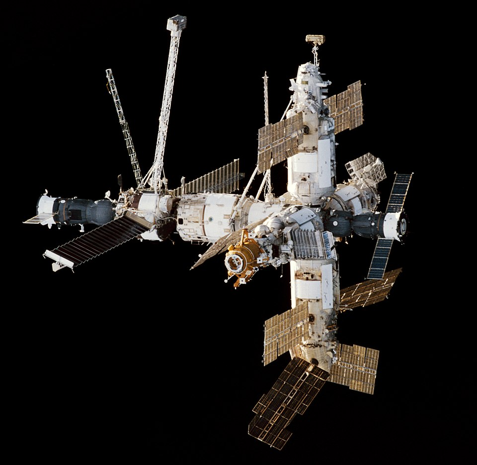
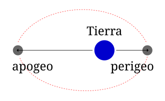
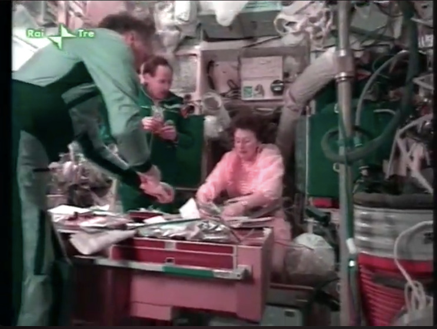
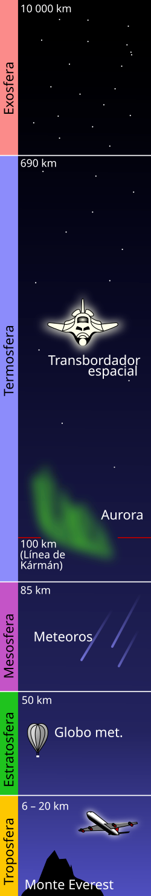
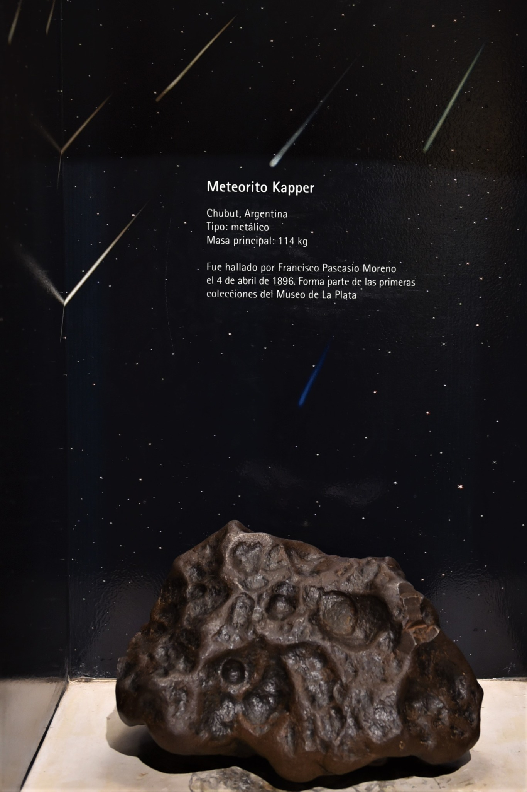
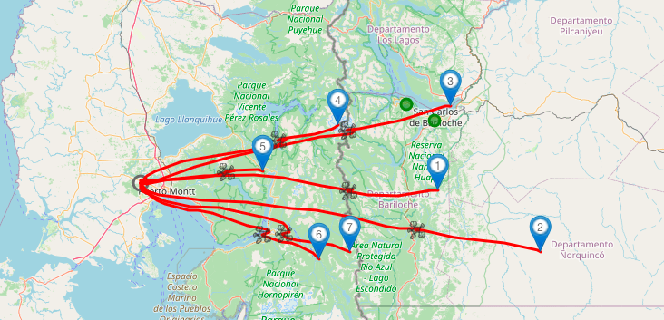

# dos hipótesis sobre dos cámara

## Vadim Yusov


vadim yusom y andrei tarkovsky


Solaris, Andrei tarkovsky


## Estación Espacial MIR




Siegfried Zielinski, Arqueologia de los medios




La estación espacial rusa [Mir](https://es.wikipedia.org/wiki/Mir_(estaci%C3%B3n_espacial))  operó en una órbita terrestre baja, con una inclinación de 51,6º respecto al ecuador y una altitud típica entre **300 y 400 km** (perigeo/apogeo ~385-393 km). Completó más de **86.000 órbitas** (**33.454.000**km) a unos 27.000 km/h, **siendo destruida de forma controlada en el Océano Pacífico Sur en 2001**.

* **Órbita:** Órbita terrestre baja (LEO), diseñada para la investigación científica y habitada continuamente.
* **Velocidad:** Aproximadamente 27.000  km/h.
* **Inclinación:** 51,6 grados respecto al ecuador.
* **Altitud:** Inicialmente sobre los 300-400 km, ajustada a lo largo de su vida útil.
* **Desorbitación:** 23 de marzo de 2001, en el Pacífico Sur.

La Mir fue la primera estación espacial modular, ensamblada entre 1986 y 1996, y __sirvió como base tecnológica para la Estación Espacial Internacional (EEI)__.


    [Mir Space Station Re-Entry And Burnup Over The Pacific Ocean](https://www.youtube.com/watch?v=h902KJb0cfE)


## Apogeo y Perigeo





[Out of Present](https://www.youtube.com/watch?v=L1In8pfdxv4) (Ujica, 1997). Narra la historia del cosmonauta __Sergei Krikalev__, quien quedó atrapado en la estación espacial MIR durante 10 meses (1991-1992) mientras la Unión Soviética colapsaba en la Tierra, convirtiéndose en el último ciudadano soviético en el espacio.


## Línea de Kármán

Se define la **línea de Kármán** como el límite entre [atmósfera](https://es.wikipedia.org/wiki/Atm%C3%B3sfera "Atmósfera") y [espacio exterior](https://es.wikipedia.org/wiki/Espacio_exterior "Espacio exterior"), a efectos de [aviación](https://es.wikipedia.org/wiki/Aviaci%C3%B3n "Aviación") y [astronáutica](https://es.wikipedia.org/wiki/Astron%C3%A1utica "Astronáutica"). Esta definición es aceptada por la [Federación Aeronáutica Internacional](https://es.wikipedia.org/wiki/Federaci%C3%B3n_Aeron%C3%A1utica_Internacional "Federación Aeronáutica Internacional"),
 que es una organización dedicada al establecimiento de estándares
internacionales y reconocedora de los récords en aeronáutica y
astronáutica.

Su altura fue estimada en 100 [km](https://es.wikipedia.org/wiki/Km "Km") sobre el nivel del mar. También se obtiene calculando la altura a la que la [densidad](https://es.wikipedia.org/wiki/Densidad "Densidad") de la atmósfera se vuelve tan baja que la velocidad de una aeronave para conseguir [sustentación aerodinámica](https://es.wikipedia.org/wiki/Sustentaci%C3%B3n_aerodin%C3%A1mica "Sustentación aerodinámica") mediante [alas](https://es.wikipedia.org/wiki/Ala_(aeron%C3%A1utica)) "Ala (aeronáutica)") y [hélices](https://es.wikipedia.org/wiki/H%C3%A9lice_(dispositivo)) "Hélice (dispositivo)") debería ser equiparable a la [velocidad orbital](https://es.wikipedia.org/wiki/Velocidad_orbital "Velocidad orbital") para esa misma altura, por lo que alcanzada esa altura por esos medios las alas ya no serían válidas para mantener la nave.





**[Meteorito Kapper ](https://www.facebook.com/photo/?fbid=1579993632433316&set=a.210572714032073), hallado por el Perito Moreno en 1896 en la provincia de Chubut (Museo de Ciencias Naturales)**


[Imagen Venus, Sonda Magallanes](https://pds-geosciences.wustl.edu/mgn/urn-nasa-pds-magellan_midr/browse/)

## Espacio exterior

El  **espacio exterior** ,  **espacio vacío** ,  **espacio sidéreo** , **espacio sideral** o simplemente  **espacio** , se refiere a las regiones relativamente vacías del [universo](https://es.wikipedia.org/wiki/Universo "Universo") fuera de las [atmósferas](https://es.wikipedia.org/wiki/Atm%C3%B3sfera "Atmósfera") de los [cuerpos celestes](https://es.wikipedia.org/wiki/Objeto_astron%C3%B3mico "Objeto astronómico"). Se usa «espacio exterior» para distinguirlo del [espacio aéreo](https://es.wikipedia.org/wiki/Espacio_a%C3%A9reo "Espacio aéreo") y las zonas terrestres. El espacio exterior no está completamente vacío de materia (es decir, no es un [vacío perfecto](https://es.wikipedia.org/wiki/Vac%C3%ADo_(f%C3%ADsica)) "Vacío (física)")), sino que contiene una baja densidad de partículas, predominantemente gas [hidrógeno](https://es.wikipedia.org/wiki/Hidr%C3%B3geno "Hidrógeno"), así como [radiación electromagnética](https://es.wikipedia.org/wiki/Radiaci%C3%B3n_electromagn%C3%A9tica "Radiación electromagnética").  Aunque se supone que el espacio exterior ocupa prácticamente todo el volumen del universo y durante mucho tiempo se consideró prácticamente vacío, o repleto de una sustancia denominada «[éter](https://es.wikipedia.org/wiki/%C3%89ter_(f%C3%ADsica)) "Éter (física)")»,
 ahora se sabe que contiene la mayor parte de la materia del universo. Esta materia está formada por radiación electromagnética, partículas cósmicas, [neutrinos](https://es.wikipedia.org/wiki/Neutrino "Neutrino") (cuya [masa](https://es.wikipedia.org/wiki/Masa "Masa") es tan pequeña que viajan a velocidades cercanas a la de la luz), [materia oscura](https://es.wikipedia.org/wiki/Materia_oscura "Materia oscura") (materia que compone casi el 90% de las galaxias, pero que no interactúa con la luz ni ha sido nunca observada) ^[[1]](https://es.wikipedia.org/wiki/Espacio_exterior#cite_note-1)^  y la [energía oscura](https://es.wikipedia.org/wiki/Energ%C3%ADa_oscura "Energía oscura"). De hecho, cada uno de estos componentes contribuye en el universo al total de la [materia](https://es.wikipedia.org/wiki/Materia "Materia"),  según estimaciones, en las siguientes proporciones aproximadas: 4,53 % de elementos pesados, 0,5 % de materia estelar, 0,3 % de neutrinos, aproximadamente 25 % de estrellas y aproximadamente 70 % de energía oscura, lo que da un total de 100,33 %, por lo que sobra un 0,33 % sin estimar. La naturaleza física de estas últimas es aún apenas conocida. Solo se conocen algunas de sus propiedades por los efectos gravitatorios que imprimen en el período de revolución de las [galaxias](https://es.wikipedia.org/wiki/Galaxia "Galaxia"), por un lado, y en la [expansión acelerada del Universo](https://es.wikipedia.org/wiki/Expansi%C3%B3n_acelerada_del_Universo "Expansión acelerada del Universo") o [inflación cósmica](https://es.wikipedia.org/wiki/Inflaci%C3%B3n_c%C3%B3smica "Inflación cósmica"), por el otro.

### Gas Hidrógeno

El hidrógeno es el [elemento químico](https://es.wikipedia.org/wiki/Elemento_qu%C3%ADmico "Elemento químico") más [abundante](https://es.wikipedia.org/wiki/Abundancia_natural "Abundancia natural") del universo, suponiendo más del 75 % en [materia normal](https://es.wikipedia.org/wiki/Bari%C3%B3n "Barión") por [masa](https://es.wikipedia.org/wiki/Masa "Masa") y más del 90 % en número de átomos. ^[[21]](https://es.wikipedia.org/wiki/Hidr%C3%B3geno#cite_note-22)^  Este elemento se encuentra en abundancia en las [estrellas](https://es.wikipedia.org/wiki/Estrella "Estrella") y los [planetas](https://es.wikipedia.org/wiki/Planeta "Planeta") gaseosos gigantes. Las nubes moleculares de H~2~
 están asociadas a la formación de las estrellas. El hidrógeno también juega un papel fundamental como combustible de las estrellas por medio
de las reacciones de [fusión nuclear](https://es.wikipedia.org/wiki/Fusi%C3%B3n_nuclear "Fusión nuclear") entre núcleos de hidrógeno.

En el universo, el hidrógeno se encuentra principalmente en su forma [atómica](https://es.wikipedia.org/wiki/%C3%81tomo "Átomo") y en estado de [plasma](https://es.wikipedia.org/wiki/Plasma_(estado_de_la_materia)) "Plasma (estado de la materia)"), cuyas propiedades son bastante diferentes a las del hidrógeno molecular. Como plasma, el [electrón](https://es.wikipedia.org/wiki/Electr%C3%B3n "Electrón") y el protón del hidrógeno no se encuentran ligados, por lo que presenta una alta [conductividad eléctrica](https://es.wikipedia.org/wiki/Conductividad_el%C3%A9ctrica "Conductividad eléctrica") y una gran [emisividad](https://es.wikipedia.org/wiki/Ley_de_Stefan-Boltzmann "Ley de Stefan-Boltzmann") (origen de la luz emitida por el [Sol](https://es.wikipedia.org/wiki/Sol "Sol")  y otras estrellas). Las partículas cargadas están fuertemente influenciadas por los campos eléctricos y magnéticos. Por ejemplo, en los [vientos solares](https://es.wikipedia.org/wiki/Viento_solar "Viento solar") las partículas interaccionan con la [magnetosfera terrestre](https://es.wikipedia.org/wiki/Magnet%C3%B3sfera_de_la_Tierra "Magnetósfera de la Tierra") generando [corrientes de Birkeland](https://es.wikipedia.org/wiki/Corriente_de_Birkeland "Corriente de Birkeland") y el fenómeno de las [auroras](https://es.wikipedia.org/wiki/Aurora_polar "Aurora polar").

Cuando se mezcla con oxígeno en una variedad de proporciones, de hidrógeno explota por ignición. El hidrógeno se quema violentamente en
el aire; se produce la ignición automáticamente a una temperatura de 560 °C. ^[[28]](https://es.wikipedia.org/wiki/Hidr%C3%B3geno#cite_note-29)^  Llamas de hidrógeno-oxígeno puros se queman en la gama del color [ultravioleta](https://es.wikipedia.org/wiki/Radiaci%C3%B3n_ultravioleta "Radiación ultravioleta") y son casi invisibles a simple vista, como lo demuestra la debilidad de la llama de los motores principales del [transbordador espacial](https://es.wikipedia.org/wiki/Transbordador_espacial "Transbordador espacial") (a diferencia de las llamas fácilmente visibles del [cohete acelerador del sólido](https://es.wikipedia.org/wiki/Cohete_de_combustible_s%C3%B3lido "Cohete de combustible sólido")). Así que se necesita un detector de llama para detectar si una fuga de hidrógeno está ardiendo. La [explosión del dirigible Hindenburg](https://es.wikipedia.org/wiki/Dirigible_Hindenburg#El_último_vuelo_del_Hindenburg)  fue un caso infame de combustión de hidrógeno. La causa fue debatida, pero los materiales combustibles en la cubierta de la aeronave fueron los responsables del color de las llamas.  Otra característica de los fuegos de hidrógeno es que las llamas tienden a ascender rápidamente con el gas en el aire, como ilustraron las llamas del  *Hindenburg* , causando menos daño que los fuegos de hidrocarburos. Dos terceras partes de los pasajeros del *Hindenburg* sobrevivieron al incendio, y muchas de las muertes que se produjeron fueron por caída o fuego del combustible [diésel](https://es.wikipedia.org/wiki/Gas%C3%B3leo "Gasóleo").


    [El desastre del Hindenburg - Imágenes reales (1937) | British Pathé](https://www.youtube.com/watch?v=fURATK5Yt30)


## Archivo

1. [Mir De-orbit Index (English)](https://www.esa.int/ESA_Multimedia/Videos/Undated/Mir_De-orbit_Index_English) [VIDEO]
2. [Égi rovar 1995 (teljes film)](https://www.youtube.com/watch?v=Tqso3igYFlU) [VIDEO]
3. [The MIR story](https://web.archive.org/web/20000821055335/http://www.irisz.hu/mir/) [WEB]
4. [The history of Mir, 1986-2000](https://archive.org/details/historyofmir19860000unse) [LIBRO]
5. [Museo del Meteorito](https://es.wikipedia.org/wiki/Museo_del_Meteorito) [LUGAR]
6. [Misteriosa «bola de fuego» sorprende a los habitantes de Chiloé: podría tratarse de un meteorito hasta chatarra espacial](https://www.elmostrador.cl/dia/2019/09/26/misteriosa-bola-de-fuego-sorprende-a-los-habitantes-de-chiloe-podria-tratarse-de-un-meteorito-hasta-chatarra-espacial/) [NOTICIA]
7. [Expedición científica busca meteoritos detectados por red de cámaras especializadas en La Higuera](https://uchile.cl/noticias/224378/expedicion-cientifica-busca-meteoritos-detectados-por-red-de-camaras) [INVESTIGACIÓN]
8. [FRIPON-Andino Stations](https://www.fcla.cl/fripon-andino) [ARCHIVO]
9. [La sonda espacial Magallanes fue desplegada por el Transbordador Espacial Atlantis como parte de su misión STS-30 en 1989.  Magallanes llegó a Venus el 10 de agosto de 1990.  La  sonda pudo recolectar 980 imágenes del planeta antes de que la misión concluyera.](https://starchild.gsfc.nasa.gov/docs/StarChild_Spanish/docs/StarChild/space_level2/magellan.html) [NOTICIA]
10. [Collection of images from the Magellan mission](https://pds.nasa.gov/ds-view/pds/viewCollection.jsp?identifier=urn%3Anasa%3Apds%3Amagellan_gravity%3Aimages&version=1.0&_gl=1*bp5y7g*_ga*MTUwMTc5MTQyMC4xNzcwMzM2MTg5*_ga_FN1NZSE6CD*czE3NzAzMzY4NjQkbzEkZzEkdDE3NzAzMzcwMzQkajkkbDAkaDA.) [DATASET]
11. [Venus Magellan Global C3-MDIR Colorized Topographic Mosaic 6600m](https://astrogeology.usgs.gov/search/map/venus_magellan_global_c3_mdir_colorized_topographic_mosaic_6600m) [IMAGEN]


## Apuntes

1. ¿Por qué los meteoritos sólo caen en el norte?
2. Venus es poco común porque gira en dirección contraria a la de la Tierra y la mayoría de los otros planetas. Y su rotación es muy lenta. **Tarda alrededor de 243 días terrestres en girar solo una vez**. Debido a que está tan cerca del Sol, un año pasa muy rápido. Venus tarda 225 días terrestres en dar toda la vuelta alrededor del Sol. Esto significa que, en Venus, un día es un poco más largo que un año.
3. Datos Misión Magallanes

```
Distancia desde el sol: 1.1 x 10^8 km
Período de órbita: 225 días terrestres
Radio: 6051 km
Periodo de rotación (sidereal): 243 días terrestres 
Densidad media: 5.24 g/cm3
Gravedad superficial: 0.907 veces la de la Tierra (8.87 m/s2)
Temperatura De La Superficie: 850 F (730 K, 454 C)
Presión atmosférica superficial: 90 veces la de la Tierra (90 +- 2 bar)
Composición Atmosférica: 
    Dióxido de carbono (96%); nitrógno (3+%); trazas 
    Cantidades de dióxido de azufre, vapor de agua, carbono 
    monóxido, argón, helio, neón, cloruro de hidrógeno, 
    Fluoruro de hidrógeno
```

```
Crucero interplanetario: 4 de mayo de 1989, al 10 de agosto de 1990 (464 dias)
Primer ciclo de mapeo: 15 de septiembre de 1990 a 15 de mayo de 1991
Período de órbita: 3.25 horas
Inclinación de la órbita: 86 grados
Mapeo de radar Perbit: 37,2 minutos
Cobertura de mapeo de radar planetario: 98%
Cobertura de datos de gravedad planetaria: 95%
Misión ampliada: 15 de septiembre de 1991
Ciclo 2: Imagen de la región del polo sur y huecos del Ciclo 1
Ciclo 3: Llene los huecos restantes y recoja imágenes estéreo
Ciclo 4: Medir el campo gravitacional de Venus
Ciclo 5: Aerofrenado a órbita circular y mediciones de gravedad global
Ciclo 6: Recopilar datos de gravedad de alta resolución y realizar experimentos de radiociencia
Experimento del molino de viento: Observar el comportamiento de las moléculas en la atmósfera superior. 
Experimento de terminación: 11 de octubre de 1994 (1986 dias total de la misión)
```
4. 17 de agosto de 2017 (STRUENDO EN LA ARAUCANÍA SERÍA UN METEORO; AUNQUE “NO HAY CERTEZA” ASEGURAN EN ASTRONOMÍA UD)[https://noticias.cfm.cl/estruendo-en-la-araucania-seria-un-meteoro-aunque-no-hay-certeza-aseguran-en-astronomia-udec/]
https://www.youtube.com/watch?v=HA1ZZz5qYZs
https://pousta.com/cielomoto-meteorito-sur/

5. Enviar un objeto a la estratosfera (a más de 20 km de altura) se logra comúnmente mediante un globo meteorológico de helio equipado con una carga útil, paracaídas y un rastreador GPS. El globo asciende hasta explotar por la baja presión, permitiendo que la carga descienda para ser recuperada. 
6. "Quizás no podré ser astronauta,pero sí llevar cosas al espacio" https://www.youtube.com/watch?v=R_uIylS1zAE
7. La red de sondas meteorológicas mundial, coordinada principalmente por la Organización Meteorológica Mundial (OMM) a través del Sistema Mundial de Observación (SMO), lanza diariamente más de 1400 radiosondas para medir la atmósfera hasta 30 km de altura. Estos globos sonda proporcionan datos críticos de temperatura, humedad, presión y viento, esenciales para modelos meteorológicos globales.

8. 

Mapa predicciones ultimos lanzamientos sondas meteorologicas RS41 todos los dias a las 12UTC desde Puerto Montt
---

9. 

Código Nacional 	410005
Código OMM 	85799
Código OACI 	SCTE
Código WIGOS 	0-20000-0-85799
Nombre de la Estación 	El Tepual Puerto Montt Ap.
Fecha de Creación 	01-06-1963 00:00
---


## Objetos posibles

- Remontaje en vivo de Out of Present de Ujica


## Herramientas

1. codigo para extraccion de videos desde URL (Sonda Magallanes) wget -r -np -nH --cut-dirs=4 -e robots=off --no-check-certificate
   --user-agent="Mozilla/5.0"
   --accept="*.jpg,*.jpeg,*.png,*.tif"
   https://pds-geosciences.wustl.edu/mgn/urn-nasa-pds-magellan_midr/browse/fmidr/
