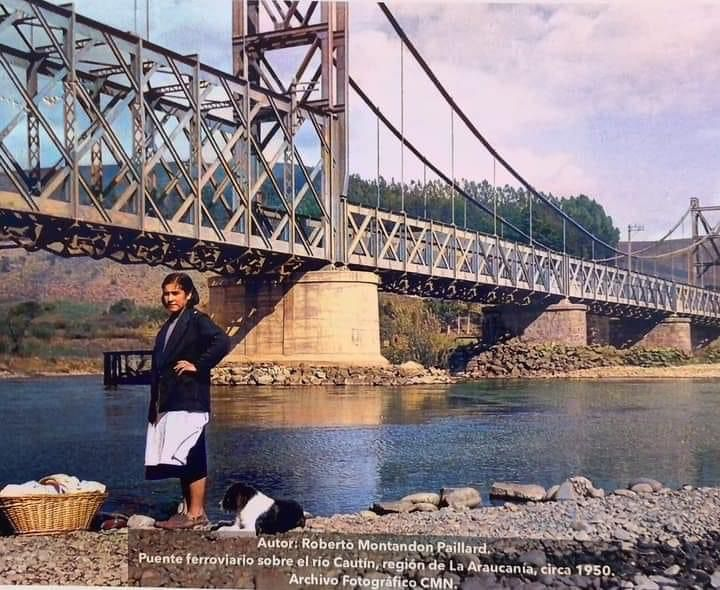
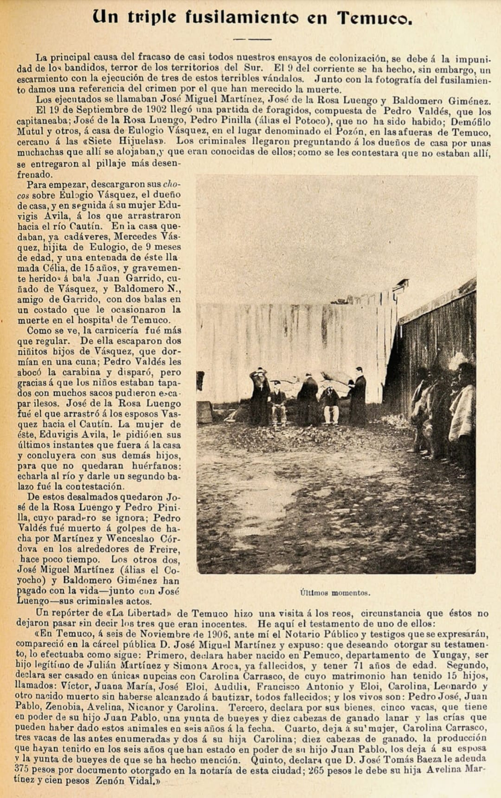
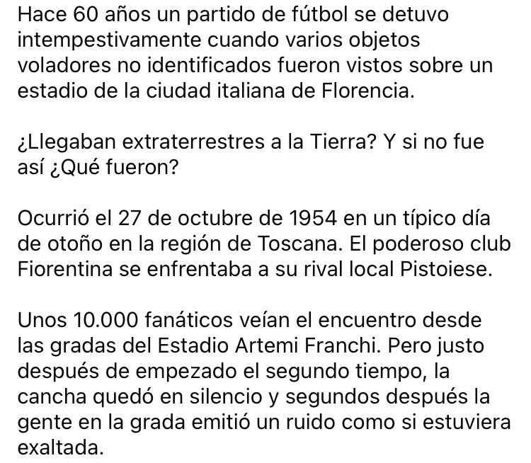
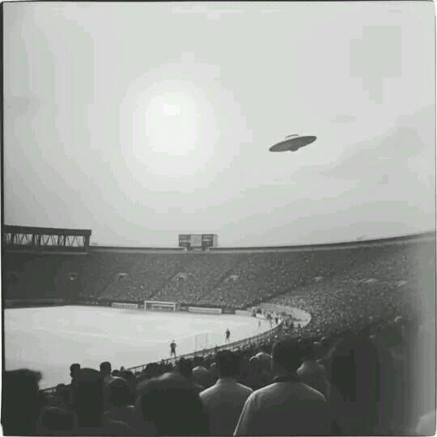
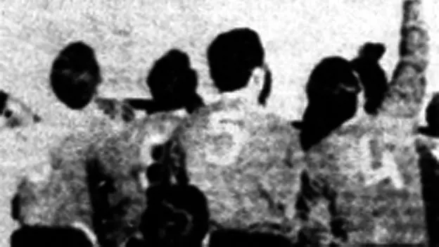
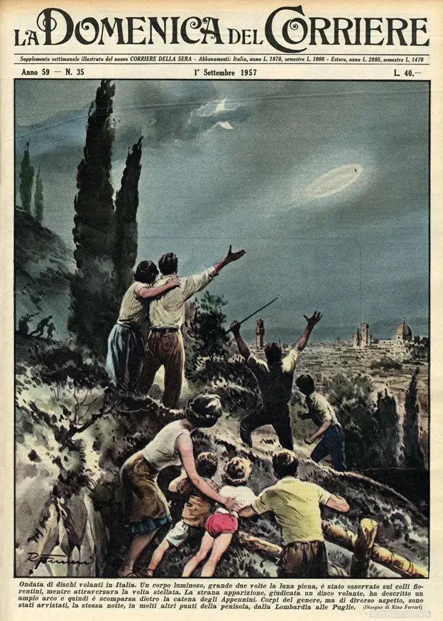
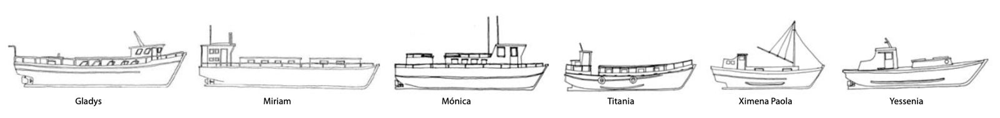

# Temuco 

1. Archivo Consejo de monumentos, Roberto Montandon paillard

2. Triple fusilamiento en Temuco, viernes 9 de noviembre de 1906.

3. El jardin de las delicias

--- 

## caries dentales

> Un 90% de los adultos mayores presenta una alta prevalencia de caries dental y enfermedad periodontal. Seis de cada diez personas poseen caries cavitadas, es decir, con una discontinuidad o abertura clara en la superficie, perceptible a la vista o el tacto. El 30% de la población posee dentición no funcional.
Uno de cada cuatro sufre pérdida total de su dentadura.

- recolectar radiografias dentales
- publicidad de revistas antiguas sobre cosas de la boca, vistas en zig zag (a proposito de la investigación de incendios)

## ovnis en un estadio

- 27 de octubre de 1954
- Estadio Artemi Franchi
- 10.000 personas
- Fiorentina v/s Pistoiese
- Florencia, Italia

Ardico magnini, jugador de la Fiorentina:

>  "Era algo que lucía como un huevo que se movía lentamente, lentamente, lentamente. Todos estaban viendo hacia arriba y había algo brillante en el cielo, plateado brillante. Estábamos impresionados, nunca habíamos visto algo así en el cielo. Nos quedamos impactados".

[https://www.bbc.com/mundo/noticias/2014/10/141022_ovni_partido_futbol_italia_ao](https://www.bbc.com/mundo/noticias/2014/10/141022_ovni_partido_futbol_italia_ao)

## Embarcaciones

