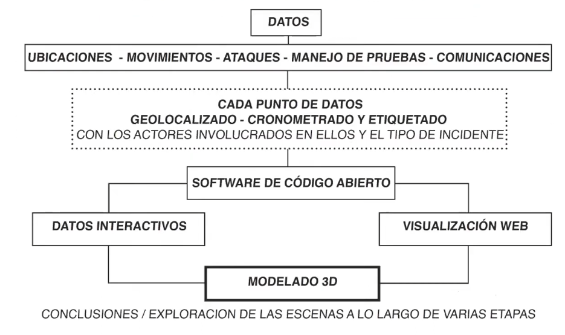

# Metodologías de investigación-creación

## javier Gil Marín 

1. El arte elevada a la categoría de pensamiento, creando investigando o investigando creando? (bourdieu)
2. Artista como Realizador de propuestas estéticas. Decodificarle de las narrativas de las prácticas contemporáneas 
3. El video como _lingua franca_
4. Tensión en el proceso de investigación-creación: **sistematización/impulso**
5. [laboratorio cinema poético](https://lab.cinemapoetico.net/)
6. _La potencia de lo nuevo_ de las prácticas artísticas, lo intempestivo, lo que no está atrapado por la predicción o resultados, el desborde de lo posible, algo deseablemente incalculable. Donde algo pueda suceder
7. La _potencia de la suspensión del tiempo y la profanación_ (Agamben). Frente al tiempo productivo introduce la lógica del tiempo libre, lejos de la eficiencia, de la lógica de medios y fines. La visibilidad del yo de la experiencia, una comunidad de sujetos expuestos u exponiendo la trama de sus relaciones. Traer el mundo como un bien común. 
8. La _potencia de la afección_, una apertura a lo indeterminado. El arte como lugar de desplazamiento de subjetividades, sujetos abiertos, flexibles, vulnerables. Frente a la lógica científica de distanciar al sujeto del mundo, en las artes el sujeto se pone en juego, lo que es , lo que piensa, lo que desea. No escribimos según lo que somos, escribimos para hacernos y deshacernos. 
9. El _logos afectivo_. La relación con los otros como fuerzas sensibles. Para pintar la montaña, lo montañoso, hay que acercarse a la montaña, perderse en ella, para capturar las sensaciones, algo muy distinto a las representaciones, el lugar de la afección sensible (cezanne)

## Arquitectura forense

- el caso de la desapariciòn forzada de studiantes en ayotzinapa
    1. __Metodos__: modelado 3D, fotogrametria, analisis de patrones, desarrollo de software, procesamiento de datos, trabajo de campo
        - restitución por imágenes y videos (reconstruccion 3d a partir de vistas de construcciones)
        - modelado 3d desde contraste con normativas (como es, cmo debe ser segun nroamtiva un esapacio dado)
        - dinámica de fluidos (por ej. del humo, según sus cualidades físicas)
    2. __metodologia__
        1. recopilacion de datos: 
            - ubicaciones
            - movimientos
            - ataques
            - manejo de pruebas
            - comunicaciones
            - (tambien podrian ser: declaraciones, )
        2. cada punto de datos GEOLOCALIZADO / CRONOMETRADO y ETIQUETADO [actores involucrados y tipo de incidente]
            - 
    