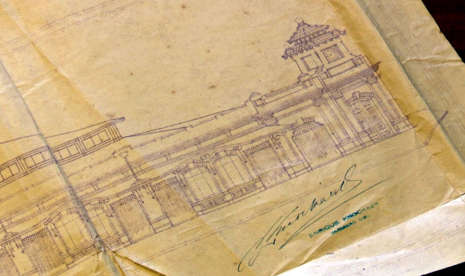

1. hoy siento un acercamiento mas genuino a la fotografia. Todas las ideas que he ido pensando respecto a las reglas que veo en la relación con los seres y las cosas que establece el objeto cámara digital.

2. los márgenes temporales que propone el proceso, construyen un espacio para un tipo de dialogo, un tipo de relacion (individual/colectiva) con la imagen, a una forma de proceso/procedimiento/cuerpo/ojo, quizas, sacralizado. aún. esto es por las dinamicas de la relación entre pasado y capitalismo (vintage > cuico)? o responde a un marco cultural que interpela a quien se acerca a estas técnicas? 

3. imágenes del futuro en el pasado, borderío y basura, piscinas enterradas, vistas desde los cerros, antenas disfrazadas. Acronias técnico-visuales, los estudios contemplativos de josef sudek en temuco, 2025. Sudek, Atget, la ciudad. la ciudad y el movimiento. la permanencia en el tiempo y el espacio que le hemos asignado de lo no vivo, que hemos creado. objetos, nohumanidades ¿desde cuando las cosas importaron menos (o más)? ¿alguna vez desde el sur hemos podido escapar a la ensoñación exotizante de la nohumanidad en las discursividades que hemos diseñado? como Emile Garreaud y Valparaíso. una mirada con forma de arquitectura de lo social, la disposición de objetos arquitéctonicos, preexistentes, desde los que se informa lo vivo, lo no vivo dispuesto en un juego de relación con el espacio y su habitar en el tiempo, también como jacques tati ¿y cuando los objetos se queman? ¿que le pasa a la gente de un pasaje cuando se quema una casa? ¿el espacio también se quema? quizas se puede pensar como un gesto concéntrico de afectación, que parte en la familia que perdió el techo, luego sus vecinos contiguos, seguramente muy preocupados por el fuego, y asi, alejándose, hasta llegar como rumor a los almácenes del barrio, espacios que nuclean la construcción mitologica del pasado colectivo. 

4. es posible una fotografia callejera hecha en colodion?

5. identificar en google earth puntos de basura en el barrio y juntarlos

6. cuerpo camara impresa en 3d. dar seguimiento a tarifas del mati

Emile Garreaud 

Josef Sudek

Brassai

