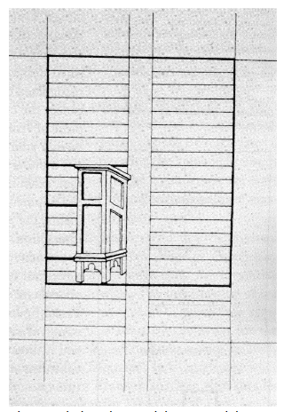

# Retícula

## Lecturas

> el cuadriculado tensiona la relación de escalas. el régimen del mapa, o de la retícula. necesita de una no referencialidad para sostener su ficción. si sobre el cuadriculado, al lado del caracol se ubica un tanque, con similar encuadre, al mismo tamaño que el caracol ¿que le pasa a la verdad del instrumento de medición? el mapa también necesita esa autonomía. la gramatica visual es subversiva frente a estos objetos.

### La Retícula. Historia, uso y significado [Jack Williamson]

1. **Elementos individuales**: el punto (o coordenada), la línea axial, y el modo de interacción.
2.  **Tipología estructural de la retícula**, cuatro subformas:
    1. a) en coordenada
    2. b) en intersección
    3. c) en módulo
    4. d) en línea
3. **Retícula del medioevo tardío:** Esta lógica constructiva soportaba el estatus tardío que representaba la retícula medieval como un juego de relaciones verticales cualitativas entre la parte de arriba que es lo supra-físico y la parte de abajo que es la realidad material, que fueron divinamente generadas por medio de puntos coordenadas concebidas como “umbrales”.  
  
4. **Retícula Cartesiana del Renacimiento**:  desplazamiento de la retícula basada en coordenadas e intersecciones a una retícula concebida en un campo abarcando puntos y ejes, poseyendo ya sea valores neutrales o numéricos (cuantitativos). 
5. 

###### Donald Byrne, “Reticulado para Manuscrito y Diseño Pictórico en el trabajo de Limbourgs, de Bedford Master y el Maestro Boucicault,” Art Bulletin LXVI, No 1 (Marzo 1984): 118-36.  

## Pesquisas
1. Indagar en el impacto, evolución, casos particulares de la reticula para el pensamiento cientifico y su imbricación con la industria del conocimiento local
2. 