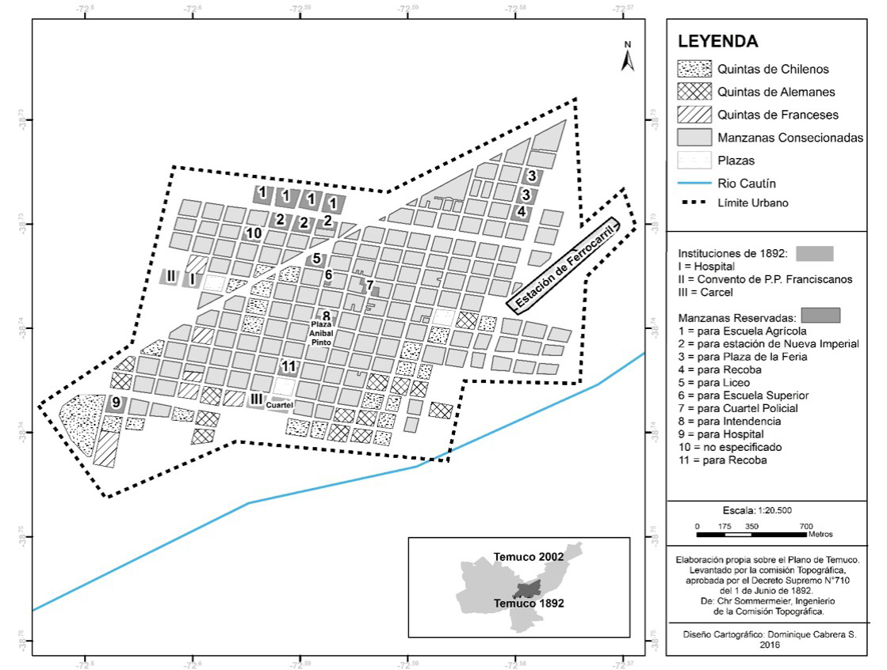
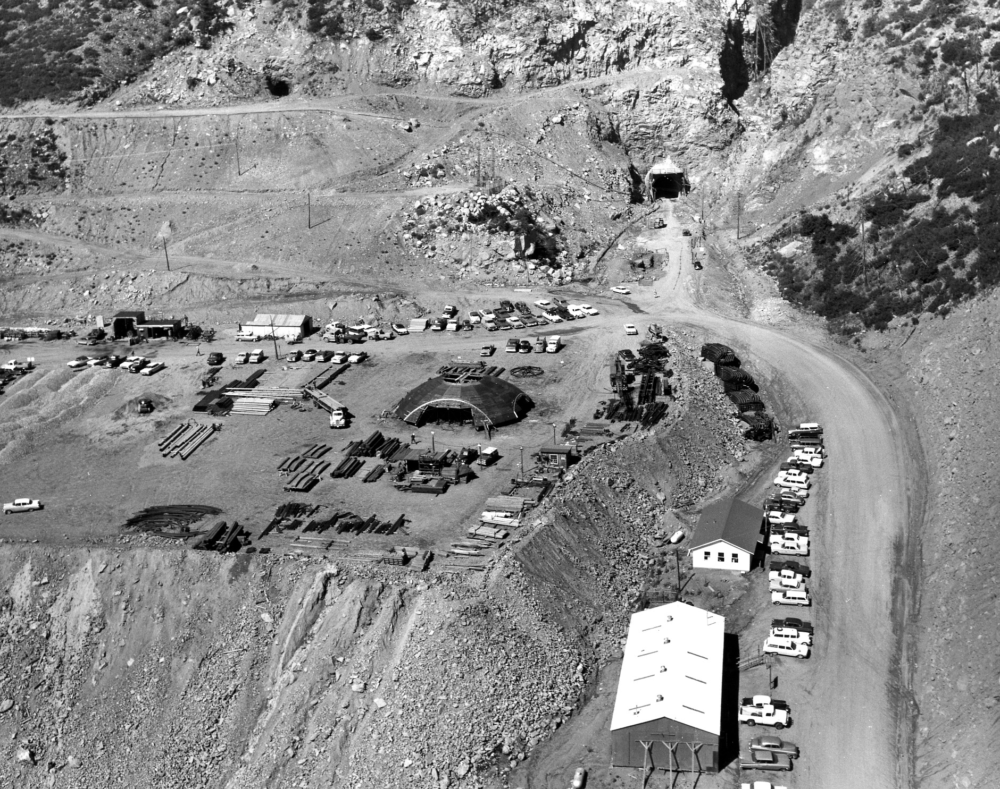

## Antecedentes

Plano de la ciudad de Temuco - la parte marcada de negro corresponde a la incendiada

## Reconstrucción histórica del blog __araucaniapatrimonial.blogspot.com__

> Mi ya desaparecido padre (__1927-2009__) me relató, ya hacen más de veinte años, una anécdota de su querido tío Domingo Aguilera Lagos, quien a inicios de los años 1900 residía en las cercanías del poblado de __Gorbea__. Domingo Aguilera era un hombre de trato agradable a quien le gustaba la música, por lo que era siempre invitado a las fiestas y reuniones, pues también poseía un artilugio llamado __Fonógrafo Edison__, con música "envasada" en cilindros. Al parecer las muchas oportunidades en que se hizo sonar la alegre música provocó que el artefacto se descompusiera, posiblemente por la ruptura de la __cuerda de acero__. El fonógrafo fue llevado para su reparación hasta una __tienda en la capital de La Frontera__, pero, lamentablemente, aquel noble aparato __sucumbió entre las llamas del gran incendio__ de Temuco, que comenzó el día _sábado_ 18 de enero de 1908.

> __José Luis Granese__, investigador de la Universidad Diego Portales, hace años recuperó información desde antiguas ediciones del diario "El Mercurio" de Santiago, la que se plasmó en el reverso de la "Lámina 02 IX región de la Araucanía", de la colección denominada "MEMORIAS DE MI REGIÓN", distribuida junto a ejemplares del Diario El Mercurio

## Revisión cobertura realizada por la revista _Zig Zag_ (editada en Santiago), número 152, Enero 26 de 1908.

> La floreciente ciudad de Temuco, de la cual hace algun tiempo dimos una serie de __vistas fotográficas interesantísimas__, ha estado a punto de ser totalmente destruida por un incendio. El fuego __principió en un edificio cercano a la Plaza de Armas__ e impulsado por un __fuerte viento del oeste__, tomó proporciones tales que llenó a la población de consternacion y espanto. __Veintiuna manzanas__ fueron totalmente reducidas a escombros. Las bombas del pueblo y las que pudieron ir de __Concepcion y otras ciudades de la frontera__ fueron impotentes para contener la impetuosidad de las llamas y se limitaron a defender de su voracidad _las casas que servían de márjen_ a aquel verdadero torrente de fuego. No ménos de __3.500 personas__ quedaron sin hogar y en la mas absoluta miseria. Las pérdidas avaluables en dinero pasan de __1.500.000 pesos__. El fuego abarcó una extensión de __quince cuadras de largo por ocho de ancho__ y terminó en la noche despues que hubo consumido todo el combustible que encontró en su derrotero, en el __Hotel Leguas por el sur__ y la __Bodega de Mac Kay__ por el norte...

>... Al dia siguiente en la estensa y ancha Avenida abierta por el fuego, veíanse __palos carbonizados__, una que otra __chimenea de cal y ladrillo__, __troncos de árboles__ quemados, __postes de luz__ eléctrica carbonizados, __máquinas__, __alambres telefónicos__ por el suelo, __montones de zinc__ quemados, ruinas, desolacion y por todas partes __escombros humeantes__.

> Aprovechando la situación angustiosa en que quedó tanta jente sin hogar, __algunos comerciantes poco escrupulosos comenzaron a esplotar el hambre, pidiendo el doble por los artículos de primera necesidad__. En esta emerjencia el gobierno impartió instrucciones a los ferrocarriles para movilizar __trenes de norte a sur__, especiales para los damnificados por el fuego.
En medio de las ruinas se han visto escenas dolorosas. Mujeres pobres llorando al lado de sus pobres viviendas reducidas a cenizas. Segun cálculo aproximado se han quemado 25 a 30 manzanas, en su tercera parte las mas importantes de la ciudad, que con este desastre queda arruinada talvez para no volver a levantarse ántes de diez años. El fuego se ramificó en varios brazos, pues dentro del área quemada han quedado pedazos intactos."

## Revisión Cobertura de El Mercurio el 18 de Enero de 1908: 

> El fuego había comenzado en la __casa de Simón Burruchaga__ a medio día en __forma lenta en un montón de tablas__. De allí se propagó a la __Proveedora del Hogar de Kuznetzoff__, en Prat esquina Puerto Montt (4), que ardió como un castillo. Pasó rápido al __edificio del frente, ocupado por la imprenta donde iba a fundarse El Sur__.

> Hubo dos muertos, __un soldado al que le cayó un tabique en la estación__ y la señora __María Isabel Carrasco, que murió a causa de la impresión__ cuando al llegar a su casa la encontró ardiendo.

> Daños al Teatro Pepper (5), el Juzgado, Cuartel de Policía del Orden, Cuartel de Policía de Gendarmería, la Bodega Mackay, Casa Comercial de Mauricio Gleisner, Armería y Ferretería de Bernasconi y el Restorán Italiano. Y las propiedades de Néstor Larenas, Salvador Urrutia, Rodolfo Urízar, Carlos Gajardo, Abraham Leiva, doctor Serrano, Montander, Bautista Merino Cruzat, Pedro Gracey, Andrés Laiseca, doctor Frías, comandante Gacitúa y Rodolfo Ovalle

4. Extractos texto Colonización y nuevo territorio:

> ... este estudio utilizó información proveniente de distintas fuentes documentales primarias. Por un lado, estas fuentes apuntan a registros institucionales de población chilena y extranjera contenida en los informes de los censos de 1895 y 190713, y registros comerciales provenientes del Archivo Regional de la Araucanía (ARA), como el Rol Comercial de Temuco de 1904, Veritas Comercial Chileno de 1912-1913 y la Guía Universo de comercio de 1925-1926. Por otro lado, y con el fin de conocer las relaciones comerciales de esta naciente elite, el artículo contempló fuentes provenientes de crónicas de la época, como el diario de vida de Emilio Appetz (ARA) y los relatos expedicionarios a la Araucanía de Gustave Verniory e Isidoro Errázuriz. Además, se integraron mapas como el primer plan regulador de Temuco de 1892 (ARA) y el plano de 191914, los cuales permitieron conocer la toponimia de la ciudad y su relación con la elite local. Por último, también se utilizó la edición especial del diario Austral correspondiente al 24 de febrero de 1981, fecha en la que se conmemoró los 100 años de la ciudad... 

> se construyó una base consolidada con datos proveniente de los registros comerciales, los cuales fueron complementados con crónicas de la época. Esta base integró dimensiones como el nombre de los comerciantes, nacionalidad, año de fundación del negocio, dirección en la ciudad, sociedades con otros comerciantes y rubro de la actividad comercial, entre otras.

> Los mapas elaborados en este artículo están basados en el plano de 1892 (ARA), el cual fue reconstruido basado en las manzanas de la época y la información cartográfica correspondiente al Censo de Población y Vivienda de 2002. A partir de esta reconstrucción, fue posible además generar un mapa de concentración de la actividad comercial en la ciudad, utilizando para ello la información proveniente de la base de datos consolidada. Todo lo anterior fue procesado en el software ArcGIS© 10.3.

Plano Sommermeier de Temuco, Comisión topográfica de 1892

Cuadro actividades económicas, Temuco 1895, a partir del censo de población de 1895

> entre los alemanes que tuvieron la posibilidad de un mayor crecimiento económico se encuentran las familias Krause y Dreves, los cuales controlaban molinos importantes en aquella época. Sin embargo, mientras los Krause desaparecen con el tiempo de la escena comercial de la ciudad, la familia Dreves se mantiene en este tipo de actividad hasta inicios del siglo XX28. Un alemán que si tiene una fuerte presencia en el rubro molino, y seguirá activo hasta principios del siglo XX, es Santiago Momberg, en posesión de la quinta 16 en el plano de Sommermeier.29

> Otras actividades comerciales relevantes entre los alemanes dueños de quintas son aquellas relacionadas con los negocios de la familia Walper30 en cervecerías, Eduardo Menzel en carnicerías y la curtiembre de Luis Westermeyer31. Estos dos últimos alemanes tendrán además una activa participación en el mundo político y social de la ciudad, ya que mientras Menzel formará una sociedad para la llegada de la electricidad a las calles de la ciudad a principios del siglo XX32, Westermeyer, si bien deja las actividades comerciales33, será regidor en la administración municipal de la ciudad en 1888 (Pino, 1969), y presidente de la primera compañía de bomberos en 189934. La fuerte presencia de alemanes en la ciudad, tanto espacial según el plano de 1892 como comercial, se verá fuertemente potenciada además por el arribo de un cónsul de Alemania en 1897, y la creación del Banco Alemán Transatlántico en 190735, lo cual marcará un carácter distintivo a la colonización comercial alemana en términos de una constitución identitaria de la nueva elite local.

## Propuesta activador ficcional

_Un simulacro, operacion d-e-i-s-i de un futuro contado desde un futuro más lejano, desenterrado en un pasado reciente, hoy expuesto ante los sentidos de quienes ya no podemos ver la relación que hubo entre las palabras y las cosas. Un artificio. La historia como un artefacto del futuro del cual nuestros pasados ya se han informado. porque el tiempo supone el peso de las historias y sus vectores, siempre reconfigurables, y ahora de nuevo. eso hemos aprendido. en su interior una imagen inexistente..._

- Una fotografia. En satélites queda el mundo anterior. Orbita alta de 26 días. Programado en lenguajes ya olvidados. En su inercia produce recuerdos, millones de millones de iteraciones sinsentido registradas para entender/expresar imágenes, difusas. Lo referencial quedó bajo la bruma de una recta infinita que desvanece todo tiempo. Hay algo en las gesticulaciones, lo que acontece en una imagen; seres, vivos o no, que la máquina es incapaz de contrastar, contornear. se rompieron los lazos de lo que existe con lo que es dicho. ¿Cual es el espejo de un máquina hecha a imagen humana, cuando estos ya no saben nombrar el mundo? Las cosas dejaron de tener nombre. 

los ultimos recuerdos generados respondían a: "el momento en que a una mujer se le cae una palangana con aceite el 18.01.1908_12:40UT".

> El significado de las palabras y la relación entre ellas El texto menciona que hay una relación entre las palabras y las cosas, pero no todos pueden ver esta relación. Además, se habla de la verdad que los satélites solos conocen sobre el mundo, tanto en el pasado como en el futuro. También se menciona que no sabemos el significado del fuego y que hoy no hay incendios. Parece haber una incapacidad de la máquina para definir y contornear una imagen, pero se reconoce que hay algo en el gesto humano. Las imágenes parecen ser borrosas y se convierten en material y forma en los recuerdos propios de las personas. Además, se menciona que en el futuro se encontrarán fotografías almacenadas en un satélite en órbita alrededor de la Tierra.

> Un Artificio. Ficción vuelto se ha Todo. Cosas las y palabras las entre relación la ver pueden no ya quienes de ojos los ante expuesto hoy reciente pasado un en desenterrado lejano más futuro un desde contado mundo del verdad(es) la(s) tienen satélites los Solos. Fuego el significa que sabemos no, incendios hay no ya Hoy. Contornear, siluetear, definir incapaz es máquina la que, estando y siendo personas, imagen una en acontece que lo, humano gesto el en algo hay, definidas no pero situadas, borrosas imagenes, devienen material, forma en recuerdos propios sus que producen tierra la en orbita satélite un almacenadas encontrarán se que, futuro del fotografías de conjunto Un. 

> Un racimo de fotografías trotando desde el pasado, se encontrarán danzando en un satélite que bucea la Tierra en ciclos de 900 segundos. Los satélites de profundidad alta que fabrican sus propios recuerdos, en forma de nubes, devienen canciones, nítidas, perdidas pero no sonadas, hay algo en el vuelo del gesto humano, lo que sucede en una imagen, los incendios siendo y durmiendo, que la máquina es incapaz de entender, colorear, o dibujar. Hoy ya no hay fuego, no sabemos lo que significa la máquina. Solos los satélites tienen la(s) mentira(s) del mundo siguiente. Los recuerdos fabricados son de una danza de nubes ocurrida hace 370 minutos. Un pasado contado desde un pasado más cercano, enterrado en un futuro antiguo, hoy oculto ante los oídos de quienes ya no pueden saborear la relación entre las palabras y las cosas. Todo se ha vuelto realidad. Un Artificio, un Artefacto del pasado que nuestro futuro ya lo ignora. Según la bitácora del horno espacial, todo empezó desde el sabor producido sobre la imagen del momento de la danza, una imagen inaudita.

## Hallazgos

## Recursos

1. [Omar Acuña, araucaniapatrimonial.blogspot.com](https://araucaniapatrimonial.blogspot.com/2012/02/el-gran-incendio-de-temuco.html)
2. [Félix Rojo-Mendoza y Javier Hernández Aracena, Colonización y nuevo territorio: la formación de la elite comercial de Temuco, 1885-1913](https://scielo.cl/scielo.php?lng=en&nrm=iso&pid=S0718-34022019000200185&script=sci_arttext&tlng=en&utm_source=pocket_shared)
3. [Satellite Catalog Number](https://es.wikipedia.org/wiki/Satellite_Catalog_Number)
