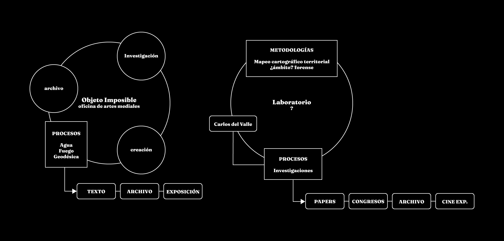

# Laboratorio transdisciplinar en prácticas socioespaciales y nuevos medios

## Marcos teórico-prácticos
1. Prácticas situadas
2. Prácticas socio espaciales críticas 
3. Cartografías críticas 
4. Transdisciplinariedad
5. Enfoque micropolítica 
6. Arte participativo- comunidades
7. Filosofía de la técnica
8. Nuevos Medios
9. Live Cinema

## Acercamientos Metodológicos
1. Mapeos cartográficos territoriales, desde un enfoque micropolítico (ver imágenes)
2. Orientada al trabajo interdisciplinario desde el laboratorio en vinculación con unidades académicas de la Universidad de distintos campos del saber y conocer.
3. Política de procesos abiertos, acceso longitudinal a la diversidad de documentos que configuran y sustentan el hacer/pensar del laboratorio
4. Consolidación longitudinal de un  archivo que permita sedimentar y acceder a los procesos de investigación-creación desarrollados por el laboratorio

## Objetivos 
### General 
1. Crear e instalar un espacio de experimentación desde procesos que vinculen la creación artística y la investigación académica
### Específicos
1. Comprender las prácticas socio espaciales, más allá de la disciplina de la arquitectura para aplicar su teoría y metodología en función de procesos investigativos transdisciplinares.
2. Indagar y trabajar en torno a los nuevos medios como campo disciplinar dinámico y extenso 
3. Aplicar en cada proceso, la interdisciplina como campo y estrategia de investigación-acción/vinculación

## Impacto
1. La materialización de procesos que desplieguen una forma de hacer/pensar la interdisciplina y la transdisciplina
2. Aportar al acervo de enfoques teoricos y practicos que hoy en la Universidad se despliegan desde el ámbito de la investigación/creación

## Líneas de acción
1. Investigación artística
2. Creación de obra

## Equipo de trabajo
1. Paulina 
2. Nico
3. Estudiantes en práctica UFRO
4. Artistas, academic@s e investigador@s invitad@s

## financiamiento

### Aportes propios (herramientas de trabajo a disposición contingente)
1. Sonido: line array de sonido (800W), tarjeta de sonido, mixer, microfonia cardioide y condensador 
2. Imagen: proyector 6.000 lumens laser para proyecciones de gran formato
3. Software: edicion de video, vectorial, sonido, programación creativa, programación visual, síntesis de video y sonido, 
4. Sensoramiento: piezoeléctricos, movimiento, infrasonidos, láser, temperatura, entre otros

### Aportes institucionales internos
#### Doctorado en Comunicación
1. Marco de validación institucional
2. Espacio físico 
    1. oficina
        1. espacio cerrado
        2. espacio ventilado
        3. espacio que se pueda oscurecer
        4. espacio que brinde minima aislación acustica
        5. 2 escritorios
        6. 1 pizarra
        7. 1 mesa de reunión
        8. 4 sillas 
        9. 2 tomas de corriente o más
        10. 1 impresora
        11. accceso plotter impresión planos
        12. papel de impresión y croqueras
        13. lápices, plumones, destacadores 
        14. Licencias de softwares
            1. QGis (cartografías)
            2. Isadora (proyecciones en vivo)
        15. 
3. Acceso a recursos no económicos
    1. bibliotecas
    2. laboratorios
4. Financiamiento directo
    1. transporte a lugares fisicos de las investigaciones
    2. financiación a investigadores, ayudantes/tesistas
    3. condiciones de financiamiento temporal para residentes
    4. insumos de consumo colectivo para visitas y reuniones con grupos y comunidades
    5. 
#### UFRO
1. Participación en fondos concursables
    - Internos
        1. CIICA
        2. Otros
    - Externos
        1. Fondos nacionales
        2. Fondos internacionales
2. Financiamiento directo

## Vinculación interna / externa
1. Talleres, muestras y exposiciones dentro y fuera de la universidad y de la región
2. Aperturas de procesos de investigación desde prácticas asociadas a nuevos medios
3. Vinculación a espacios de formación de pregrado en unidades académicas de la universidad
4. Publicación en revistas indexadas y libros 
5. Participación en congresos nacionales e internacionales
6. Participación en Festivales de cine nacionales e internacionales 

## Ejemplos de procesos en curso: 
1. Edumeet (Chile/España) Edumeet Ecotopías International Scientific Congress. Architectures in/for/before/against the climate crisis  27+28 Organiza: Trans / DPA ETSAM. Universidad Politécnica de Madrid En colaboración con: UDLA. Universidad de las Américas (Chile)
2. Tercer Encuentro Latinoamericano de Cine Casero, Amateur y Huérfano.  ULTRAcinema. Mexico

## Propuesta de calendario de implementación
Marcha blanca: Enero 2025

## Metodologia
1. __Investigación previa__: definición de perímetro de lectura inicial y pre-mapeo de infraestructuras vinculadas a la cultura
    - Definición de un punto cero, siempre es físico, siempre geolocalizable, es existente en el tiempo (no necesariamente en el presente), el acceso puede ser físico o remoto al punto.
    - Alrededor del punto cero se establece un perimetro inicial de busqueda (el canon habla de 500mt en zonas uurbanas y de 2km (en zonas rurales).
    - la infraestructura vinculada a la cultura, son dimensiones de observacion: arquitectonica, objetual, practicas, relaciones, sujetos politicos, sociales y culturales;  
2. Taller de consulta. Articular con la comunidad
3. Investigacion de campo.  
4. Trabajo de escritorio.

---

# jueves 21 de noviembre 2024

## propuesta reunión pre marcha blanca

1. Presentación diagrama de trabajo
2. Listado de requerimientos
3. Propuestas de proyectos de investigación asignadas al Laboratorio
4. Elaboración documento científico en torno a la metodología de investigación del Laboratorio
5. Definición del nombre del Laboratorio
6. Definicion final fecha inicio del trabajo

## Tareas acordadas
1. OK **Enviar correo** con solicitud de reunión durante la primera quincena de diciembre > paulina
2. OK **Adición de textos** para bibliografia compartida en Drive > tarea compartida en carpeta de Oi Drive *bibliografía > laboratorio*
3. **Hacer presentación** para reunión con listado de topicos a conversar > nico

