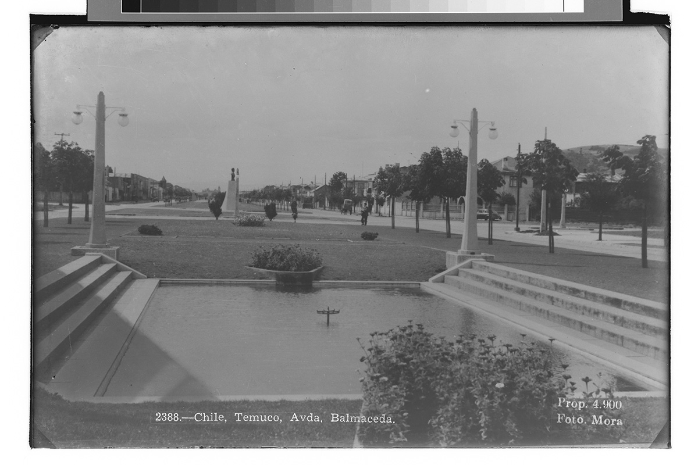

## mapeo

1. La pileta de los patos chinos, Avda. Balmaceda. Vista parque, pileta cuadrada y en los costados una escalera de tres peldaños. Senderos rodeados de pasto. Un busto en altura de perfil al centro de los pastos. https://culturadigital.udp.cl/index.php/fotografia/chile-temuco-av-balmaceda/

1. elevacion 1:1 pileta (pre estudio > buscar planos en municipio, OOPP)
2. medicion volumetrica del agua
3. flora y fauna circundante / microscopia de no humanidades
4. mapa de humedad relativa
5. replica material de componentes
6. catalogo botanico
7. 

6. piscina vacia en el borde del ñielol

2. socavones con agua en la cancha atrás del gimnasio olímpico 

3. antiguo canal en calle matta 

4. Ojo de Agua a la orilla del puente nuevo 
5. Ojos de agua detrás de la cancha de amanecer 

Sacar el rollo > > > > >
7. estero temuco, Pedro de valdivia
8. Canal que recorre calle Caupolican 
9. cegamiento de canal calle las Heras desde Montt, se deseaba abovedar el canal, canal que recoge derrames de la ciudad. La solución temporal es cerrar el canal de las Heras con una especie de compuerta y llevar sus aguas al canal de Caupolicán 
10. Canal tapado con tapas de madera en calle prieto
11. laguna los patos el carmen
12. 

lore gimenes visuales, como pse puede llegar a entender la visualidad a distintas escalas. interesa como levantamiento de evidencia desde distintas escalas posibles. trabajar con cartografias y mapas permite entender el mundo de una manera sintetica y expandida, determinado esto por una imagen. 

la datificacion de la realidad
el dato como ficcion
proceso de acumulación
el mapa como objeto intermedial

1. presentar requerimiento de transparencia de la municipalidad respecto a la situacion de la pileta enterrada e balmaceda, tras las obras de mejoramiento urbano del año pasado.

2. _En el ASP no existen cursos de agua regulares, salvo pequeñas vertientes naturales de poco caudal. Las más importantes son las denominadas Antonio Coñoepan y Agua Santa. Cabe destacar la presencia del canal Gibbs, que recorre gran parte del límite sur del ASP y que además lleva un importante caudal de 1000 a 1200 litros por segundo. Este cuerpo de agua abastecía de agua potable a parte de la población de Temuco._

3. _El Monumento Natural Cerro Ñielol (M.N. Cerro Ñielol) es una de las 106 áreas silvestres protegidas (ASP) del Estado._

4. _En el año 2023 investigadores de la Universidad Católica de Temuco realizaron un estudio respecto a las flores exóticas en áreas protegidas del país. Tomaron en cuenta los registros realizados a lo largo de los años por otros investigadores para determinar la riqueza de estas especies y el índice de invasibilidad en estas áreas. El resultado fue que el ASP con mayor riqueza de especies exóticas en comparación a la al total de especies en el área es el Cerro Ñielol con un 39,2% de especies exóticas, seguido por PN Torres del Paine (32%) y RN Lago Peñuelas (27,5%). Mientras que el índice de invasibilidad, es decir, cuan expuesta está el ASP de ser invadida por especies exóticas, también concluyó que el área protegida más afectada es el cerro Ñielol, con 93 plantas invasoras en una superficie de sólo 89 hectáreas. La obtención de estos resultados se puede deber a diversas causas, como el número excesivo de visitantes al MN Cerro Ñielol, que ha aumentado en los últimos años, y destruye parte del sotobosque, permitiendo la invasión de tales especies (malezas). Y la cercanía de la ciudad al Monumento, lo que permite mayor accesibilidad a especies exóticas tanto de flora como fauna._

---

###### TERRITORIO OPERACIONAL PLANTA GENERAL AGUAS ARAUCANIA
---

[se trataría de una estructura dependiente de un establecimiento educacional, ya que el preinforme de Bomberos establece que se trata de fuego multicompartimental en un recinto educacional, ubicado dentro del perímetro de la Avenida San Martín, calle Aldunate, Bello y General Mackenna. Con el correr de los minutos, trascendió que se trata de una edificación que está destinada al nivel de enseñanza preescolar de la Escuela Francia de Temuco.](https://uatv.cl/2024/05/23/incendio-afecta-a-inmueble-en-pleno-centro-de-temuco/)

---
