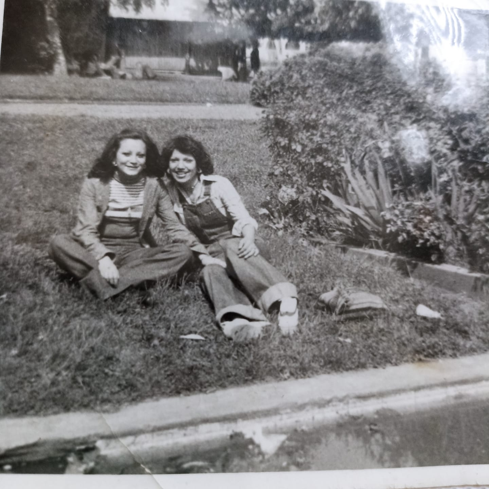

## mapeo

1. La pileta de los patos chinos, Avda. Balmaceda. Vista parque, pileta cuadrada y en los costados una escalera de tres peldaños. Senderos rodeados de pasto. Un busto en altura de perfil al centro de los pastos. https://culturadigital.udp.cl/index.php/fotografia/chile-temuco-av-balmaceda/

2. socavones con agua en la cancha atrás del gimnasio olímpico 
3. antiguo canal en calle matta 
4. Ojo de Agua a la orilla del puente nuevo 
5. Ojos de agua detrás de la cancha de amanecer 

