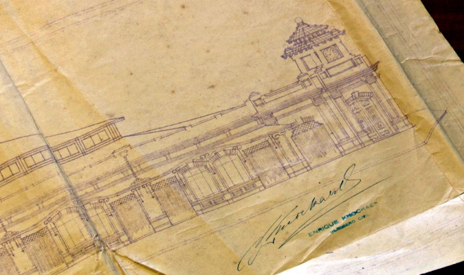

# icendio en el mercado

1. [Sobreseen definitivamente investigación por incendio en mercado de Temuco sin culpables ](https://www.biobiochile.cl/noticias/nacional/region-de-la-araucania/2017/04/12/sobreseen-definitivamente-investigacion-por-incendio-en-mercado-de-temuco-sin-culpables.shtml)
    - 107 locales comerciales
    - seis mil metros cuadrados
    - más de 800 personas se vieron afectadas al quedar sin trabajo
    - investigación duró 11 meses
    - la causa del incendio fue una explosión por saturación de gas en el local 25, donde hubo trabajos de gasfitería
2. [Mercado de Temuco: La historia del que fue el motor comercial y turístico de La Araucanía ](https://www.biobiochile.cl/noticias/2016/04/21/mercado-de-temuco-la-historia-del-que-fue-el-motor-comercial-y-turistico-de-la-araucania.shtml)
    - fundación en 1930, gobierno de Carlos Ibáñez del Campo, alcalde de temuco Eduardo Solano Illanes, llamado originalmente _Mercado de Abastos_. ceremonia de colocación de la primera piedra, en octubre de 1928, se firmó un acta que se guardó en un tubo de metal, que se dejó en un bloque de cemento; la copia estaba en las oficinas de la administración del Mercado.
    - “antes de 1928, este sector era un sitio eriazo, en esta manzana vacía la gente venía a vender sus productos, lanas, verduras, cereales, trigo, etcétera y con el tiempo las autoridades de esa época hicieron un galpón”.

Detalle del Plano de la fachada del Mercado Modelo hacia calle General Aldunate. Firmado por Enrique Knockaert. Fuente: Fondo Notarios de Temuco, (vol. 234, 1927).Archivo Regional de la Araucanía