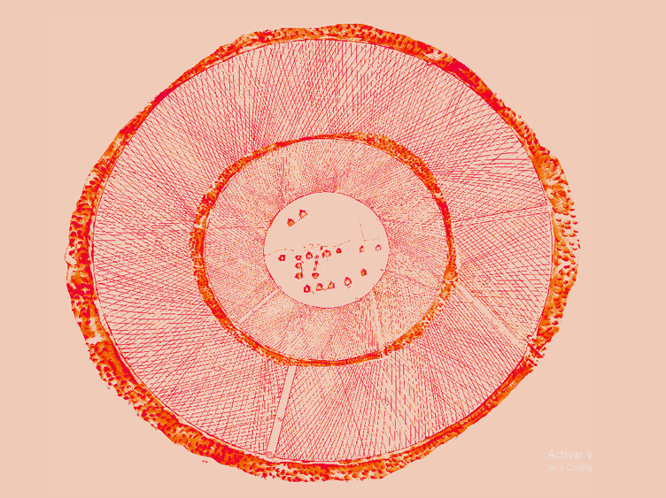
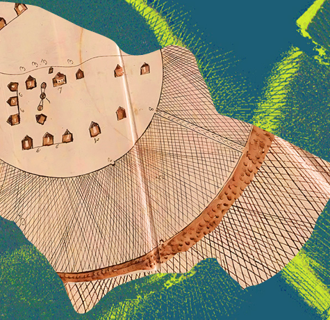
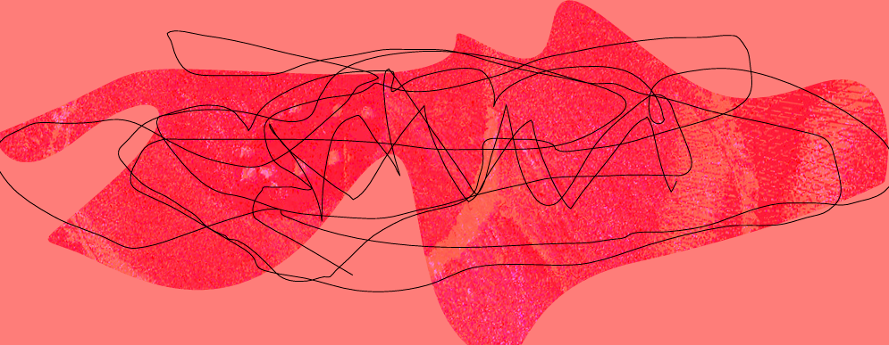

## Indagaciones
1. **Poligonias** de quilombos
2. Lineaturas en los **patrones de vuelos** de las abejas
3. el texto como dispotivo cosmo**gráfico**

## Texto Curatorial 

Hay un dicho africano que dice: **mientras la historia de la caza al león sea contada por los cazadores, los leones serán siempre perdedores**. En este sentido, se hace necesario y urgente ampliar y profundizar la visión en torno a cuestiones relacionadas con temáticas raciales que nos permitan discutir y analizar la posibilidad de construcción de otras poéticas. Poéticas que puedan reflexionar sobre cómo los cuerpos racializados, especialmente los cuerpos negros, excluidos de la producción simbólica hegemónica y del discurso sobre sí,  produzcan narrativas, amplíen el repertorio de representación existente sobre sí mismos y nombren sus experiencias desafiando el mundo que limita su habla o ignora sus vidas. Ya que **las bases históricas de la descolonización se establecieron en 1955, en la Conferencia de Bandung**, siendo
uno de sus objetivos deconstruir las principales macronarrativas occidentales, y que Fanon (1961) en _Condenados de la Tierra_ sentó las bases políticas y epistémicas del mismo, se abrieron nuevas posibilidades para el desarrollo del pensamiento crítico y para la creación de nuevas narrativas. **Según el filósofo y escritor Dénètem Touam Bona, desde el siglo XVI, en los márgenes de las colonias del Nuevo Mundo, han surgido sociedades de esclavos fugitivos**: palenques y cumbes en Hispanoamérica, quilombos y mocambos en Brasil, comunidades de cimarrones en Jamaica y Florida, Campus en Guyana y Surinam.

Argumenta que más allá de sus diferencias, **estas comunidades boscosas comparten el mismo arte de escapar**: los desechos en el bosque constituyen la matriz de sus culturas. Así, la fuga se compone siempre en contrapunto a las máquinas de captura. Al sistema colonial que fomenta su necropolítica en relación a los cuerpos racializados.

La historiadora brasileña **Beatriz Nascimento** establece que los quilombos en Brasil articularon nuevas formas de organización, tanto políticas como sociales, con implicaciones ideológicas muy fuertes en la vida de la población negra en el pasado y que se proyecta después de la abolición, en el siglo XX. Entendiendo el tiempo en su perspectiva en espiral, donde se desmantela una idea colonial lineal del tiempo, la 3ra edición del Festival Kuruche se convierte en un palenque/quilombo, se constituye como **un espacio/tiempo para la elaboración de un nuevo paisaje y la producción de poéticas**, reuniendo a artistas que en sus obras reflexionan sobre el pasado, construyendo
futuros posibles en el ahora. De esta forma, ***el festival se convierte en un movimiento de fuga, un momento de celebración de libertades**.

## QUILOMBOS EN BRASIL: UN ANÁLISIS DE LA IDENTIDAD, DERECHOS Y RECONFIGURACIÓN HISTÓRICA

1. "Al categorizar al otro, se crea una diferencia y una distancia con el yo" (Bourdieu, 1989).
2. "Cada sociedad moldea el espacio de acuerdo con su propia perspectiva, estableciendo un contexto fijo en el cual incorpora y encuentra sus recuerdos".
3. "Asociación directa entre el color negro y una posición social inferior".
4. Las identidades son construcciones de significado, mientras que los roles están vinculados a funciones específicas (Castells, 2002).
5. “Remanentes", artículo 68 del ADCT de la Consitución Brasileña de 1988.
6. "¿Hasta qué punto los quilombos preservan tradiciones africanas de vida o representan creaciones más o menos originales en América? Esto implica examinar hasta qué punto la organización social y las estructuras de poder en los quilombos reproducen las de los estados africanos, operando como una forma de resistencia cultural".
7. "En 1982, el Grupo de Asesoría y Participación del Gobierno del Estado de São Paulo propuso un informe que defendía la esterilización de mujeres negras y pardas. La justificación se basaba en proyecciones demográficas que indicaban el aumento de la población negra, lo que podría llevar a una mayor representatividad política de los afrodescendientes".
8. "Quilombo de Machadinha, situado en Quissamã, en el Estado de Río de Janeiro (Brasil). Una práctica antigua era enterrar el cordón umbilical del bebé en el patio trasero de la casa o lanzarlo al tejado cuando nacía un niño. Cuando se les preguntaba sobre el territorio, los habitantes afirmaban que nunca abandonarían ese lugar, ya que sus cordones umbilicales estaban enterrados en la tierra (Alves, 2016)". 
9. Beatriz Nascimento (apud RATTS, 2006), mujer quilombola y negra, define el quilombo de manera amplia, describiéndolo como **una historia** (entramado de herencia cultural, social y económica).
10. Según Little (2002), para entender la relación específica que un grupo social mantiene con su territorio, es fundamental utilizar el concepto de **cosmografía**. La cosmografía de un grupo abarca su sistema de propiedad, los vínculos emocionales que establece con su territorio específico, la historia de su ocupación preservada en la memoria colectiva, la utilización social del territorio y los métodos de defensa adoptados por él.
11. Antes de la constitucion de 1988: “terras de santo”, “terras de indias” (que no deben confundirse con las tierras indígenas), “terras de negros”, “fondos de pasto” y “pastos comunales”, invisibles ante el ordenamiento jurídico.
12. La Comunidad conocida como Mumbuca está ubicada en la zona rural del municipio de Mateiros, en el estado de Tocantins, y está compuesta por alrededor de 150 miembros resultado de la mezcla de negros e indígenas (posiblemente Xerente). Su nombre proviene de las abejas mumbuca, nativas de la región. Las primeras casas construidas estaban rodeadas por colmenas de esta especie.
13. Tres características distintivas definen a la Comunidad Mumbuca: 1) la habilidad en la artesanía con buriti y capim dourado; 2) una fuerte conexión religiosa; y 3) un liderazgo femenino sólido.

## Patrones de vuelo de Levy 

1. El patrón consiste en alternar una serie de movimientos cortos al azar de tipo browniano (movimiento aleatorio que se observa en las partículas que se hallan en un medio fluido (líquido o gas), como resultado de choques contra las moléculas de dicho fluido) con otros de trayectorias más largas.
2. Geometría fractal de la naturaleza
3. Se define como una implementación de los procesos de Markov, en los que la distribución de probabilidad del valor futuro de una variable aleatoria depende únicamente de su valor presente, siendo independiente de la historia de dicha variable. 

movimiento browniano

patron de levy a la izq. movimiento browniano a la der.

## Cosmografías

1. Ciencia que describe las **características del universo en forma de cartografías** combinando elementos de la **geografía** y la **astronomía**.
3. El trabajo de **Ptolomeo**, redescubierto en el siglo XV con la masificación de la imprenta, posibilitó avances en las tecnicas de **cálculo de latitudes y longitudes (sistema de coordenadas)**, posibilitando la navegación a mar abierto en base a la observación astronómica.
4. "Los descubrimientos geográficos realizados por exploradores y soldados españoles en el nuevo mundo fueron pronto centralizados en la Casa de Contratación, institución creada por la monarquía española para supervisar y controlar la navegación hacia las Indias. Durante todo el siglo XVI fue el organismo de investigación cartográfica más importante de Europa, sin embargo, el carácter empírico de su cartografía y la confidencialidad en que se mantuvo, limitó su impacto en la sociedad. La labor de difusión de los nuevos conocimientos geográficos fue tomada por los impresores centroeuropeos, en particular en los Países Bajos, centro mercantil y financiero de Europa septentrional, que hacia fines del siglo XVI y XVII se convirtieron en el principal centro cartográfico del continente. La generalización de la imprenta y el uso del grabado en madera y posteriormente en cobre, abarataron los costos de confección y reproducción de los mapas, generando una verdadera edad de oro de la cartografía. En 1570, Abraham Ortelius publicó el primer atlas moderno de la historia, abriendo una época de auge de los editores holandeses. En las décadas posteriores, su labor fue imitada por otros importantes cartógrafos, como el propio Gerard Mercator, Cornelis de Jode, Willem Janszoon Blaeu, Johannes Janssonius, Frederick de Wit y Nicolas Sanson D'Abbeville."
5. "En 1507, éste fue bautizado como América por el editor alemán Martin Waldseemüller, nombre que fue consagrado poco tiempo después por Gerard Mercator."

