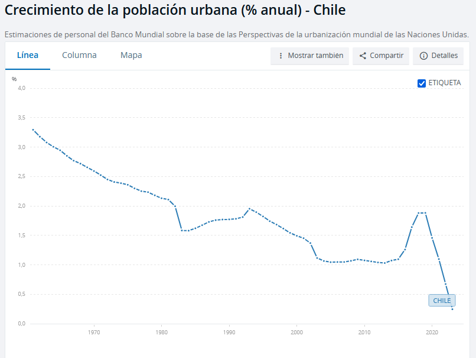

## marco investigación
- que?
    - la relación entre la arquitectura, la basura domiciliaria y las aves silvestres
- donde?
    - general
        - Poblacion Temuco
    - específico
        - puntos de disposición periódica (lunes-martes-miércoles) de basura domiciliaria
        - puntos de pernoctamiento de aves

1. medición de la magnitud de los puntos de disposición de basura domiciliaria
2. caracterización de la composicion de la basura domiciliaria
3. definición de la aves silvestres presentes en el barrio
4. definición de las rutas de abastecimiento de comida de las aves
5. contabilización de colisiones de pajaros contra ventanas de la casa

## la ciudad, el barrio 

### crecimiento de la población urbana en Chile

### **ZCH (zona de conservación histórica) Población Temuco**
>La Zona que corresponde a la Población Temuco es un sector con características singulares por la presencia de distintos conjuntos de poblaciones de vivienda de los años 40, 50 y 60 los cuales son representativos de la época y de un modo de vida en comunidad. Existen al menos tres tipos de viviendas con diferentes características, una de dos pisos con antejardín y pareada por ambos lados; otra de dos niveles en fachada continua, pareada por un solo costado; y otra de un modelo pareado por ambos lados, con antejardín y con gran pendiente en cubiertas con mansarda. Las distintas poblaciones tienen diferentes grados de
intervención, con ampliaciones y reemplazos de inmuebles.
https://www.temuco.cl/wp-content/uploads/2022/04/Cap6-1-Estudio-Patrimonio.pdf

---

## Los pájaros

El **éxito evolutivo de las aves** se debe a:

1. capacidad de posarse en los árboles
2. los distintos usos de sus cantos
3. inteligencia
4. diversidad de sus nidos

### clasificacion de las aves
- *Passeriformes* (del frances *Passer* [gorrión], *«los que tienen forma de gorrión»*): se conocen comúnmente como **pájaros** y a veces **aves cantoras** o **pájaros cantores**. Abarca **más de la mitad** de las especies de aves del mundo. Son el **grupo de vertebrados terrestres más diversificado**, con más de **cinco mil setecientas** especies identificadas. Contiene **más de ciento diez familias**. Está dividido en tres subórdenes: dos principales, _**Passeri** (Cantores)_ y _**Tyranni** (Clamadores)_, y un tercero más reducido, _**Acanthisitti.** (Acantisítidos)_ 

- Los humanos y las aves tienen el mismo tipo y número de huesos en el brazo
- El esqueleto de las aves es más ligero que el de los mamíferos porque sus huesos contienen aire en lugar de médula ósea.
- Las aves son endotérmicas, es decir, pueden mantener su temperatura corporal constante.
-  Las aves son tetracromáticos, tienen cuatro receptores de colores: UV, azul, verde y rojo, mientras que nosotros somos tricromáticos y solo vemos tres colores: azul, verde, rojo. Las aves pueden ver en un rango espectral de luz visible más amplio que los humanos, que va de aproximadamente 360 a 750 nanómetros, mientras que el de los humanos va de 410 a 730 nanómetros. Las aves también pueden percibir la luz a través de la glándula pineal y el hipotálamo.
-  se cree que las palomas son mejores para la detección de color que cualquier animal en la Tierra y se usan a menudo en misiones de búsqueda y rescate.

---

> "Algo que también es evidente y que es provocado por la presencia de estructuras diseñadas por el hombre, son las colisiones que varias especies de aves tienen contra las ventanas de los edificios. Estos eventos son relativamente comunes, por lo que se ha llegado a establecer “que una de las mayores amenazas modernas contra las poblaciones de aves son las ventanas” y las cuales representan “la tercera causa de mortandad de aves relacionadas por actividades humanas” (Leahy 1982, Gill 1995)" ([Baños, 2009, p. 63](zotero://select/library/items/GTW6Z6A5)) ([pdf](zotero://open-pdf/library/items/5UY84NZ3?page=3))

- Los pájaros se comportan más acertivos frente al riesgo de los cristales, vidrios y espejos entre (1) el fin del invierno/inicio de la primavera, y (2) al inicio del verano

- uno de los causantes de la mayor cantidad de muertes de pajaros son los apoyos de aisladores rigidos

### monitoreo de aves

1. El monitoreo de fauna silvestre consiste en el seguimiento y registro datos de un individuo, población o comunidad animal en el tiempo, con
el fin de observar cambios espaciales y temporales en su abundancia distribución o características generales que ayuden a un mayor
entendimiento de su ecología y de los factores que influyen positiva o negativamente sobre ellos.
2. E l monitoreo de fauna silvestre consiste en el seguimiento y registro de datos de un individuo, población o comunidad animal en el tiempo, con el fin de observar cambios espaciales y temporales en su abundancia, distribución o características generales que ayuden a un mayor
entendimiento de su ecología y de los factores que influyen positiva o negativamente sobre ellos.
3. Para _diseñar un monitoreo a largo plazo_ de la fauna es necesario determinar, en primera instancia, los **objetivos**, luego los **componentes a medir**, las **metodologías** que se usarán y los **responsables** del monitoreo.

 

## bibliografia y documentos de estudio
- [Manual de métodos de campo para el monitoreo de
aves terrestres](https://www.avesdecostarica.org/uploads/7/0/1/0/70104897/manual_de_metodos.pdf)

## pesquisas
- buscar cartografias mayores elevaciones arquitectonicas de la ciudad
- ir a esperara a un pajaro frente al ventanal del ultimo piso de un edificio

# sobre los pájaros
## Comportamiento

El comportamiento de las aves en bandada se rige por tres reglas simples, y se puede entender con la física del vuelo y el Principio de Bernoulli: 

1. __Separación__: Cada pájaro se mueve para evitar chocar con los demás
2. __Alineación__: Cada pájaro intenta seguir la dirección de sus vecinos
3. __Cohesión__: Cada pájaro sigue la posición media de sus vecinos

El vuelo de las aves se basa en el __Principio de Bernoulli__, que establece que la presión del aire disminuye a medida que aumenta su velocidad. Las aves utilizan esta fuerza de empuje para crear sustentación en sus alas. 
Las aves también tienen adaptaciones que les permiten volar en bandadas sin chocarse, como: 

1. Sus alas y músculos de vuelo
2. La rigidez y forma asimétrica de sus plumas
3. La capacidad de controlar la alineación de sus plumas 

El comportamiento de las aves en bandada es similar al de otros animales, como los peces y los insectos. En 1986, se desarrolló un programa de simulación llamado boids, que imita el comportamiento de las aves en bandada

# hallazgos

## El exterminio de gorriones en China

idea medioambiental desarrollada durante el gobierno comunista de Mao Zedong como parte del proyecto denominado _Gran Salto Adelante_, y dentro de la denominada _Campaña de las cuatro plagas_ (__rata, gorrión, mosca y mosquito__. Tras el rechazo unánime de los zoólogos, las cuatro plagas se redefinieron en 1960 como _ratas, chinches, moscas y mosquitos_. Más tarde, debido a los cambios en la vida social, las chinches fueron sustituidas por las cucarachas. Así, las cuatro plagas se definieron finalmente como _moscas, mosquitos, ratas y cucarachas_. ). Supuestamente se obtendría más toneladas de grano al desaparecer un ave que se alimentaba de ellos. El ave fue prácticamente extinguida de China pero su desaparición provocó la aparición de plagas de insectos —como la langosta— que asolaron los cultivos siendo uno de los detonantes de la Gran hambruna china y obligando al gobierno chino a rectificar la decisión importando gorriones desde la URSS. A día de hoy no se han recuperado las poblaciones de gorriones previas al exterminio

El argumento para exterminar al __gorrión molinero __(Passer montanus) era que devoraba el grano almacenado. Se publicaron cálculos según los cuales cada gorrión comía de media 4,5 kg de grano al año. Por lo tanto, matando a un millón de gorriones, se podría alimentar a 60 000 personas más. Según palabras de Mao Zedong, «_los gorriones son una de las peores plagas, son enemigos de la revolución, se comen nuestras cosechas, mátenlos. Ningún guerrero se retirará hasta erradicarlos, tenemos que perseverar con la tenacidad del revolucionario_».

Para exterminar a los gorriones, se movilizó a la población para que golpease ollas y sartenes hasta que los gorriones y otros pájaros cayeran muertos de agotamiento. Sin embargo, el procedimiento más frecuente era la eliminación por envenenamiento. Los nidos fueron destruidos, los huevos rotos y los polluelos acabaron muertos al no haber adultos que los alimentasen. La campaña supuso un éxito y estuvo a punto de aniquilar por completo a los gorriones.2​

Algunos gorriones encontraron refugio en los locales extraterritoriales de varias misiones diplomáticas en China. El personal de la embajada de Polonia en Pekín negó la solicitud china de ingresar a las instalaciones de la embajada para ahuyentar a los gorriones que se escondían allí y como resultado la embajada fue rodeada por personas con tambores. Después de dos días de tambores constantes, los polacos tuvieron que usar palas para limpiar la embajada de gorriones muertos​. 

A pesar de haber frenado la persecución, el daño causado por el aniquilamiento de los gorriones trajo consigo la proliferación de las langostas. Estas fueron responsables de una terrible plaga que formó una parte muy importante de __la Gran hambruna china__, periodo de 3 años que pusieron fin al Gran Paso Adelante en el que se estima que el número de muertos oscila entre 15 millones y 45 millones.6​7​8​9​ Las condiciones de miseria fueron terribles, las cosechas fueron devoradas por las langostas y montones de personas murieron en la pobreza. 

