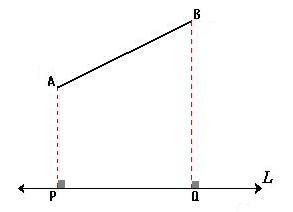

# __TEXTO 1__

[...] un objeto abierto manifiesta la _condensación_ de los gestos productores. Una conexión de las épocas pasadas, que es un conocimiento _como en el presente_.

Tenemos relaciones metabólicas y urbanas [...] las personas y las cosas están biológicamente constituidas o fabricadas, y luego se re-crean de nuevo en relaciones. Murmuraciones en las araucarias. Al inicio solo había llegado un hipopótamo al parque zoológico privado gratuito con milquinientos animales de todas partes. Había un guacamayo azul por el cual pagó cien mil dólares. Se extinguió hace ya unos años. Ahora científicos brasileños los envían con científicos alemanes que los crían y envian de vuelta para ser _reintroducidos progresivamente en la naturaleza_. Un pensar discreto sobre lo invisible, como electrosmog circulando la energía del entretenimiento, la emergencia, y el ruido para la orientación de aves vía ondas de radio AM. Se podían ver veintisiete lagos artificiales llenos de cisnes, gansos, patos, pelícanos, delfines rosados del Amazonas. Gorriones y el ruido de las máquinas. Encontré un titular que decía: _hay obras de arte hasta en los baños_. Al final, fueron once los que quedaron libres cuando se decretó muerte forzosa por las consecuencias, bajo criterios científicos, del vivir de los animales sobre el espacio, las cosas y la vida de otros seres.  _Fuera de toda intervención del lenguaje, el color de la corbata sitúa a todo individuo en el seno del grupo humano con tanta precisión como la mancha roja del petirrojo en una sociedad de pájaros._ Los hipopótamos no eran de ahí. Vivían mejor que en su lugar de origen, y al parecer, con el repertorio que nos hemos provisto, la idea del vivir mejor, aun cuando sea consecuencia de la captura y comercio ilegal transacional de animales exóticos, no emerge con criterio de posibilidad fuera de lo humano y sus objetos. Dos ejecutivos alemanes de Porsche con licencia de caza se ofrecieron a ir en compañía del ejército. Para quienes vivían ahí el problema fue el proceso de descomposición de las vísceras abandonadas en el lugar luego de la ejecución. Existencias deviniendo basura, habitando un mundo de cosas y seres expulsados del régimen de lo vivo, pero que aun así, permanecen componiendo y vivenciando nuestros también propios sistemas de afectaciones, relaciones, exclusiones, reconfigurando contínuamente el espacio de todo. Lo vivo, modelado por gestos en una escala de componentes, la construcción de la ciudad. La primera imagen que me pulsó fue el fotograma de unas bandurrias hundiendo los picos dentro de pozas oscuras de líquidos percolados en el borde de una calle cercana a la estación de ferrocarriles. Durante el primer día, uno de agosto, las ráfagas de viento alcanzaron velocidades cercanas a los 100 kilómetros por hora. Diez días antes en Puerto Saavedra, en el gran muro de piedra, dos buitres miraban el mar desde una pequeña cueva. Luego vinieron los enjambres. En una pragmática sin distancias entre el pensar, a la escala de un pájaro, y el hacer, cumplen tres reglas de manera cointuitiva. Cada pájaro se mueve para evitar chocar con los demás. Cada pájaro intenta seguir la dirección de sus vecinos. Cada pájaro sigue la posición media de sus vecinos. El murmullo deviene vestigio de la habitación humana, y al enunciarlo se esquematiza. Como una hoja de papel cualquiera, con figuras distribuidas sobre el blanco graficando puertas rellenas con degradados, proyectando líneas Desde sus vértices que siguen puntos de fuga poco diferenciados en orientación que conforman en el plano proyectado un conjunto de curvas de dos oscilaciones. Algunas de ellas emergen desde los vertices de un esquema arquitectónico desplazado desde lo profundo de la hoja. Un mapa develando el instersticio entre el habitar, el movimiento, la mirada y sus formas de representación. _De parte a parte parece que la ciudad continuara en perspectiva multiplicando su repertorio de imágenes: en cambio no tiene espesor, consiste sólo en un anverso y un reverso, como una hoja de papel, con una figura de este lado y otra del otro, que no pueden despegarse ni mirarse._ A lo largo de cada línea, automóviles o sartenes golpeados por palos _hasta que los gorriones y otros pájaros caigan muertos de agotamiento...

---

# __26-01-2025__

Una sabe, sin ser biólogx u ornitologx, que ese tipo de animales en cualquier otra condición no consumirían esa agua. En ese proceso tu entiendes, mirando las imágenes, sin ser experta, uno sabe que no es lo que ese animal históricamente ha consumido. La imagen lo está diciendo. Pero quizás lo que interesa de esa imagen no es entender sus _relaciones de consumo_, porque al trasladar los puntos de vista, la imagen se expande. Se abre a reconfiguraciones en sus modos y escalas. Se vuelve central lo que está dentro de la imagen, _qué está pasando_ en la imagen, el _líquido_ en sí. Su evidencia material. La discusión se drena hacia especulaciones de los posibles orígenes de sus restos, el estado de las cosas ahí presentes. Se van armando campos que habilitan nuevas miradas sobre los cuerpos y objetos, sus fuerzas y relaciones, también otras formas y niveles de representación. Los componentes químicos que tienen las aguas que estos seres beben ¿son cartografiables?

La mirada construye objetos dentro de objetos orientando accesos, la imagen deviene interfaz; un componente codificado, abstracción de presentes en un pasado que fue presente para esa imagen, para ese objeto de registro, para quien cartografía. La imagen, al no estar atada a esta lectura mas bien perimetral que hacemos cotidianamente de ellas, informa sobre lo que está ocurriendo dentro de ella, aún sin detenerse exclusivamente en su representación o narración. Cada pixel resulta en dato. Se espacializa el objeto imagen, se vectoraliza. Se rompe el arriba hacia abajo, de izquierda a derecha, y en el camino, se nos desordena la idea de cultura y técnica, la relación entre las imágenes y el tiempo. Las limitaciones que el tiempo le impone, porque mirando así puedes volver al espacio, está hablando todavía, pero no como ecos de la muerte. Estan en sus presentes propios, en potencia de relación.

Al final tiene que ver con el propio despliegue. Si nosotros vamos a la feria cuando empiece a llover, probablemente los vamos a encontrar. Porque no es la ciudad patrimonial. Es la ciudad en la que se vive y sus futuros posibles, imaginados. Un continuo, en el que la ciudad, o el lugar desde el que se mira, se sitúa en el presente. Estos ejercicios nos pueden llevar a entender la tensión que nos genera este presente continuo, desde los propios materiales de la ciudad. No hay nada que dar cuenta, no hay nada que visibilizar. No hay nada que ir a buscar. Es la propia consecutividad en la aproximación a partir de distintos campos desde donde uno mira y espacializa la ciudad, que te dice sobre la ciudad. No nos iremos a sentar a la feria a esperar hasta que algo acontezca ahí, quedaría fijo. Si nosotras decimos ahora, ¿salgamos, vamos al almacén? es ese trecho. El asunto trata de cómo miramos lo que está en el presente. Cómo lo fijamos.

Haber puesto la cámara a la altura de los pájaros permite entrar al régimen de lo que se intenta observar. Uno podría listar la cantidad de cositas que hay, se ven en el agua. Se hizo una declaración: Temuco, ciudad verde del _sur de Chile_, proyectos de transformación, pensando en esos conceptos. Más verde que Cochamó, que La Junta, que Coyhaique. Pero claro, no lo tenemos. Entonces tenemos que llegar a eso, interviniendo arquitectónicamente. Entre las personas que piensan esto dicen _vamos a convertir la ciudad en eso_. Nos vemos atravesados por el presente. No hay nada que invite a recordar o a soñar. Cada vez que comíamos, estaba el nido ahí. Y ya no está. Y tenemos imágenes de que estuvo ahí. ¿lo desarmaron? Se va fijando una forma de estudios de gestos, de una naturaleza muy simple, que permiten elaborar modos de entender la ciudad. La imagen deja de ser una imagen en cuanto discurso visual, y pasa a ser un recordatorio, cambia en su estatuto de representación. Se transforma en un repositorio de indicios, de relaciones en distinción segun su materialidad.