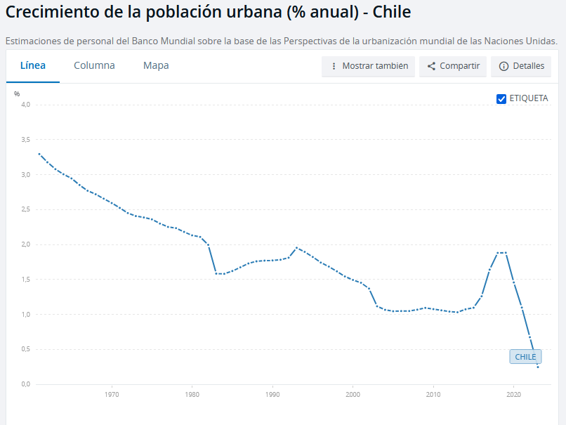
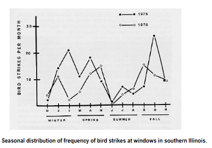
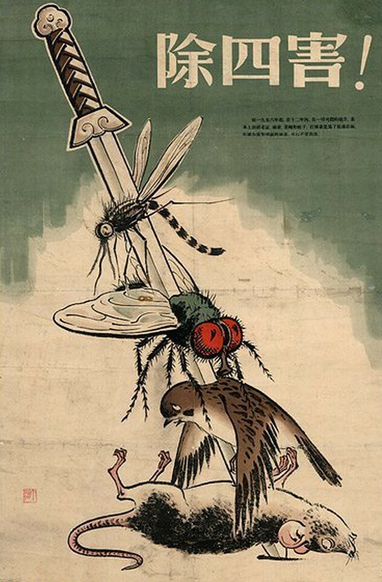

## marco investigación

- que?
  - la relación entre la arquitectura, la basura domiciliaria y las aves silvestres
- donde?
  - general
    - Poblacion Temuco
  - específico
    - puntos de disposición periódica (lunes-martes-miércoles) de basura domiciliaria
    - puntos de pernoctamiento de aves

1. medición de la magnitud de los puntos de disposición de basura domiciliaria
2. caracterización de la composicion de la basura domiciliaria
3. definición de la aves silvestres presentes en el barrio
4. definición de las rutas de abastecimiento de comida de las aves
5. contabilización de colisiones de pajaros contra ventanas de la casa

## la ciudad, el barrio

### crecimiento de la población urbana en Chile

### **ZCH (zona de conservación histórica) Población Temuco**

> La Zona que corresponde a la Población Temuco es un sector con características singulares por la presencia de distintos conjuntos de poblaciones de vivienda de los años 40, 50 y 60 los cuales son representativos de la época y de un modo de vida en comunidad. Existen al menos tres tipos de viviendas con diferentes características, una de dos pisos con antejardín y pareada por ambos lados; otra de dos niveles en fachada continua, pareada por un solo costado; y otra de un modelo pareado por ambos lados, con antejardín y con gran pendiente en cubiertas con mansarda. Las distintas poblaciones tienen diferentes grados de
> intervención, con ampliaciones y reemplazos de inmuebles.
> https://www.temuco.cl/wp-content/uploads/2022/04/Cap6-1-Estudio-Patrimonio.pdf

---

## Los pájaros

El **éxito evolutivo de las aves** se debe a:

1. capacidad de posarse en los árboles
2. los distintos usos de sus cantos
3. inteligencia
4. diversidad de sus nidos

### clasificacion de las aves

- *Passeriformes* (del frances *Passer* [gorrión], *«los que tienen forma de gorrión»*): se conocen comúnmente como **pájaros** y a veces **aves cantoras** o **pájaros cantores**. Abarca **más de la mitad** de las especies de aves del mundo. Son el **grupo de vertebrados terrestres más diversificado**, con más de **cinco mil setecientas** especies identificadas. Contiene **más de ciento diez familias**. Está dividido en tres subórdenes: dos principales, _**Passeri** (Cantores)_ y _**Tyranni** (Clamadores)_, y un tercero más reducido, _**Acanthisitti.** (Acantisítidos)_
- Los humanos y las aves tienen el mismo tipo y número de huesos en el brazo
- El esqueleto de las aves es más ligero que el de los mamíferos porque sus huesos contienen aire en lugar de médula ósea.
- Las aves son endotérmicas, es decir, pueden mantener su temperatura corporal constante.
- Las aves son tetracromáticos, tienen cuatro receptores de colores: UV, azul, verde y rojo, mientras que nosotros somos tricromáticos y solo vemos tres colores: azul, verde, rojo. Las aves pueden ver en un rango espectral de luz visible más amplio que los humanos, que va de aproximadamente 360 a 750 nanómetros, mientras que el de los humanos va de 410 a 730 nanómetros. Las aves también pueden percibir la luz a través de la glándula pineal y el hipotálamo.
- se cree que las palomas son mejores para la detección de color que cualquier animal en la Tierra y se usan a menudo en misiones de búsqueda y rescate.

---

> "Algo que también es evidente y que es provocado por la presencia de estructuras diseñadas por el hombre, son las colisiones que varias especies de aves tienen contra las ventanas de los edificios. Estos eventos son relativamente comunes, por lo que se ha llegado a establecer “que una de las mayores amenazas modernas contra las poblaciones de aves son las ventanas” y las cuales representan “la tercera causa de mortandad de aves relacionadas por actividades humanas” (Leahy 1982, Gill 1995)" ([Baños, 2009, p. 63](zotero://select/library/items/GTW6Z6A5)) ([pdf](zotero://open-pdf/library/items/5UY84NZ3?page=3))

- Los pájaros se comportan más acertivos frente al riesgo de los cristales, vidrios y espejos entre (1) el fin del invierno/inicio de la primavera, y (2) al inicio del verano

- uno de los causantes de la mayor cantidad de muertes de pajaros son los apoyos de aisladores rigidos

### monitoreo de aves

1. El monitoreo de fauna silvestre consiste en el seguimiento y registro datos de un individuo, población o comunidad animal en el tiempo, con el fin de observar cambios espaciales y temporales en su abundancia distribución o características generales que ayuden a un mayor entendimiento de su ecología y de los factores que influyen positiva o negativamente sobre ellos.
2. El monitoreo de fauna silvestre consiste en el seguimiento y registro de datos de un individuo, población o comunidad animal en el tiempo, con el fin de observar cambios espaciales y temporales en su abundancia, distribución o características generales que ayuden a un mayor
   entendimiento de su ecología y de los factores que influyen positiva o negativamente sobre ellos.
3. Para _diseñar un monitoreo a largo plazo_ de la fauna es necesario determinar, en primera instancia, los **objetivos**, luego los **componentes a medir**, las **metodologías** que se usarán y los **responsables** del monitoreo.

## bibliografia y documentos de estudio

- [Manual de métodos de campo para el monitoreo de
  aves terrestres](https://www.avesdecostarica.org/uploads/7/0/1/0/70104897/manual_de_metodos.pdf)

## pesquisas

- buscar cartografias mayores elevaciones arquitectonicas de la ciudad
- ir a esperara a un pajaro frente al ventanal del ultimo piso de un edificio

# sobre los pájaros

## Comportamiento

El comportamiento de las aves en bandada se rige por tres reglas simples, y se puede entender con la física del vuelo y el Principio de Bernoulli:

1. __Separación__: Cada pájaro se mueve para evitar chocar con los demás
2. __Alineación__: Cada pájaro intenta seguir la dirección de sus vecinos
3. __Cohesión__: Cada pájaro sigue la posición media de sus vecinos

El vuelo de las aves se basa en el __Principio de Bernoulli__, que establece que la presión del aire disminuye a medida que aumenta su velocidad. Las aves utilizan esta fuerza de empuje para crear sustentación en sus alas.
Las aves también tienen adaptaciones que les permiten volar en bandadas sin chocarse, como:

1. Sus alas y músculos de vuelo
2. La rigidez y forma asimétrica de sus plumas
3. La capacidad de controlar la alineación de sus plumas

El comportamiento de las aves en bandada es similar al de otros animales, como los peces y los insectos. En 1986, se desarrolló un programa de simulación llamado boids, que imita el comportamiento de las aves en bandada

# hallazgos

## El exterminio de gorriones en China

idea medioambiental desarrollada durante el gobierno comunista de Mao Zedong como parte del proyecto denominado _Gran Salto Adelante_, y dentro de la denominada _Campaña de las cuatro plagas_ (__rata, gorrión, mosca y mosquito__. Tras el rechazo unánime de los zoólogos, las cuatro plagas se redefinieron en 1960 como _ratas, chinches, moscas y mosquitos_. Más tarde, debido a los cambios en la vida social, las chinches fueron sustituidas por las cucarachas. Así, las cuatro plagas se definieron finalmente como _moscas, mosquitos, ratas y cucarachas_. ). Supuestamente se obtendría más toneladas de grano al desaparecer un ave que se alimentaba de ellos. El ave fue prácticamente extinguida de China pero su desaparición provocó la aparición de plagas de insectos —como la langosta— que asolaron los cultivos siendo uno de los detonantes de la Gran hambruna china y obligando al gobierno chino a rectificar la decisión importando gorriones desde la URSS. A día de hoy no se han recuperado las poblaciones de gorriones previas al exterminio

El argumento para exterminar al __gorrión molinero __(Passer montanus) era que devoraba el grano almacenado. Se publicaron cálculos según los cuales cada gorrión comía de media 4,5 kg de grano al año. Por lo tanto, matando a un millón de gorriones, se podría alimentar a 60 000 personas más. Según palabras de Mao Zedong, «_los gorriones son una de las peores plagas, son enemigos de la revolución, se comen nuestras cosechas, mátenlos. Ningún guerrero se retirará hasta erradicarlos, tenemos que perseverar con la tenacidad del revolucionario_».

Para exterminar a los gorriones, se movilizó a la población para que golpease ollas y sartenes hasta que los gorriones y otros pájaros cayeran muertos de agotamiento. Sin embargo, el procedimiento más frecuente era la eliminación por envenenamiento. Los nidos fueron destruidos, los huevos rotos y los polluelos acabaron muertos al no haber adultos que los alimentasen. La campaña supuso un éxito y estuvo a punto de aniquilar por completo a los gorriones.2

Algunos gorriones encontraron refugio en los locales extraterritoriales de varias misiones diplomáticas en China. El personal de la embajada de Polonia en Pekín negó la solicitud china de ingresar a las instalaciones de la embajada para ahuyentar a los gorriones que se escondían allí y como resultado la embajada fue rodeada por personas con tambores. Después de dos días de tambores constantes, los polacos tuvieron que usar palas para limpiar la embajada de gorriones muertos.

A pesar de haber frenado la persecución, el daño causado por el aniquilamiento de los gorriones trajo consigo la proliferación de las langostas. Estas fueron responsables de una terrible plaga que formó una parte muy importante de __la Gran hambruna china__, periodo de 3 años que pusieron fin al Gran Paso Adelante en el que se estima que el número de muertos oscila entre 15 millones y 45 millones.6789 Las condiciones de miseria fueron terribles, las cosechas fueron devoradas por las langostas y montones de personas murieron en la pobreza.

Contruir un proceso de investigación sentado sobre relaciones, desde una _axiomática de las ciencias humanas basada sobre una táctica de las operaciones_ que permitan diseccionar la mirada que articula lenguaje.

> __el ser en el lugar__: tenemos relaciones metabólicas y urbanas: las personas y las cosas están biológicamente constituidas o fabricadas, y luego se re-crean de nuevo en relaciones ontogenéticas, la primera “creación” tiene que ver con procesos que uno podría llamar “transformaciones de la naturaleza”, mientras que el segundo es en su totalidad un “sistema de devenir” que es también un “sistema de conocimiento y agenciamiento” que pone las cosas en marcha, de tal forma que estas estén disponibles a la mano, para que cualquier ser humano pueda utilizarlas. Así, las cosas y las personas definen su “ser”, en primer lugar, en virtud de sus transformaciones de los materiales y la energía asociada a su metabolización o fabricación, y, en segundo lugar, en virtud de sus “dónde” (lugar y espacio de las cosas), que en nuestro caso remite a lo urbano. Puesto de otro modo, el carpintero no es un carpintero sin sus herramientas y las mantiene a tal condición de que estén ubicadas y disponibles, colocándolas y organizándolas en su lugar después de haberlas usado. Por el contrario, si pones sus herramientas en una zanja se convertirán en pedazos de acero oxidado. (Stephen Read)

> __la energía__: Haff es un geólogo y él vio esta tecnosfera artificial a escala global como algo que se asentaba entre la atmósfera, la biósfera y la geósfera. El modelo que estaba desarrollando Haff me dejó claro que la tecnosfera se ha unido parasitariamente a la biósfera y la geósfera y se mantiene a través del consumo de materiales y energía de estos, acelerando masivamente la pérdida entrópica en ellos. (Stephen Read)

> __las lógicas__: que organizan la tecnosfera se dividen [...] en dos. Por un lado, __como una organización__, en la cual los carpinteros ajustan sus bancos de trabajo, los bibliotecarios mantienen los libreros organizados, los supermercados nos presentan productos básicos y las casas, pueblos, ciudades y regiones, estaciones de tren, estacionamientos y aeropuertos se mantienen en relaciones apropiadas y utilizables entre sí. Luego, al mismo tiempo, está la organización comprendida __como flujos de materiales y energía y sus transformaciones en formas simbólicas y de productos__ que eventualmente encajarán en los espacios de la primera lógica. Es significativo que la primera lógica sea comprendida como ver, conocer y actuar en el mundo. La segunda lógica no necesita ser vista o entendida necesariamente, al menos no en una vida activa cotidiana. En efecto, ocultamos los flujos de electricidad y agua en nuestras casas en paredes y ductos y tenemos poca idea de dónde provienen las verduras que compramos en el supermercado. Este “ocultamiento” tiene el efecto de hacer que la naturaleza se retraiga, se invisibilice y se subordine, a la vez que esté justo “allí” para nosotros en el punto de entrega, cada vez que lo necesitemos.  Los conductos, cables y tuberías, los materiales que se transportan y las mercancías que se entregan, constituyen así una especie de “inframundo” junto a los espacios de conocimiento y actuación. (Stephen Read)

> __los automoviles y el estado__: a medida que los sistemas se escalan, producen nuevos órdenes y lógicas de nuevos sistemas ampliados, como cosas y poblaciones que existen en estas escalas más amplias. El Estado, por ejemplo, tiene sus propias lógicas y racionalidades, que se imponen al carpintero en formas que lo obligan o lo dirigen dentro de estos nuevos órdenes. Todo carpintero, panadero o agricultor o cualquier otra persona, se convierte localmente en un sujeto estatal y se le obliga – por la fuerza si es necesario – a que contribuya a la conservación de este nuevo orden en una interminable batalla contra la entropía. Por lo tanto, las demandas de la maquinaria estatal no son tan sólo racionalidades internalizadas, sino también en lo que respecta a su durabilidad [...] El “_sistema-dónde_” humano técnico da a conocer las racionalidades del Estado moderno y sus demandas en espacios estatales, lugares y prácticas. De esta forma, el Estado exigirá que todo el mundo tenga un vehículo cuando uno viva en una ciudad difusa, pero también impondrá los requerimientos de energía del vehículo, incluyendo su fabricación, las carreteras y todo el resto de los edificios y barrios asociados al automóvil. Al mantenerse como un orden autónomo, la maquinaria del Estado extrae cantidades prodigiosas de material y energía de carácter externalizado. Probablemente no comemos significativamente mejor que nuestros ancestros cazadoresrecolectores, pero usamos 60 veces la energía per cápita que ellos usaron. De esta forma, el proceso de metabolización del Estado tiene profundas consecuencias ambientales, sociales y de otros tipos, no siempre obvias.

---

_Sólo si somos capaces de habitar,_
_podemos construir_

---

Las plumas primarias y secundarias
son rémiges (plumas de vuelo) en las alas de las aves, diferenciadas por su ubicación y función: las primarias son largas y están en la punta del ala (parte de la "mano"), dando propulsión y velocidad; las secundarias se unen al cúbito (el "antebrazo") y crean la superficie aerodinámica para la sustentación y el planeo. Juntas, las primarias y secundarias (y a veces las terciarias) forman las "plumas de vuelo" esenciales para el movimiento aéreo de las aves

---

_Utilizando un lápiz duro, se dibujan sobre una pared durante un minuto líneas
paralelas de 30 cm de largo separadas entre sí por cerca de 30 mm. Bajo esta fila
de líneas, se dibuja otra fila por un espacio de diez minutos. Bajo de esta fila de
líneas se dibuja otra fila por un espacio de una hora.

con un lapiz negro se dibuja durante diez minutos desde el punto cero 120 lineas.

 _Topología de lo irreal, [...] un lugar catastrófico de aparición y neutralización de lo diagramático_

 objetos

1. radio AM

# __TEXTO 1__

[...] un objeto abierto manifiesta la _condensación_ de los gestos productores. Una conexión de las épocas pasadas, que es un conocimiento _como en el presente_. Al inicio solo había llegado un hipopótamo al parque zoológico privado gratuito con milquinientos animales de todas partes. Había un guacamayo azul. Pagó cien mil dólares. Se extinguió hace ya unos años. Ahora científicos brasileños los envían con científicos alemanes que los crían y envian de vuelta para ser _reintroducidos progresivamente en la naturaleza_. Pensar discreto sobre lo invisible, como electrosmog circulando la energía del entretenimiento, la emergencia, y el ruido para la orientación de aves vía ondas de radio. Se podían ver veintisiete lagos artificiales llenos de cisnes, gansos, patos, pelícanos, delfines rosados del Amazonas. Gorriones y el ruido de las máquinas. Encontré un titular que decía _hay obras de arte hasta en los baños_. Al final, fueron once los que quedaron libres cuando se decretó muerte forzosa por las consecuencias, bajo criterios científicos, del vivir de los animales sobre el espacio, las cosas y la vida de otros seres.  _Fuera de toda intervención del lenguaje, el color de la corbata sitúa a todo individuo en el seno del grupo humano con tanta precisión como la mancha roja del petirrojo en una sociedad de pájaros._ Los hipopótamos no eran de ahí. Vivían mejor que en su lugar de origen. La vida condicionada por lo humano y sus objetos. Dos ejecutivos alemanes de Porsche con licencia de caza se ofrecieron a ir en compañía del ejército. Para quienes vivían ahí el problema fue el proceso de descomposición de las vísceras abandonadas en el lugar luego de la ejecución. Objetos basura, habitando un mundo de cosas y seres expulsados del régimen de lo vivo, pero que aun así, permanecen componiendo y vivenciando nuestros también propios sistemas de afectaciones, relaciones, exclusiones, reconfigurando contínuamente el espacio de todo. Lo vivo, modelado por gestos en una escala de componentes, la construcción de la ciudad. La primera imagen que apareció fue el fotograma de unas bandurrias hundiendo los picos dentro de pozas oscuras de líquidos percolados en el borde de una calle cercana a la estación de ferrocarriles. KLosprimeros días las ráfagas de viento llegaron a 100 kilómetros por hora. Diez días antes en Puerto Saavedra, en el gran muro de piedra, dos buitres nos mientras miraban el mar desde una pequeña cueva. Luego vinieron las pequeñas murmuraciones. En una pragmática sin distancias entre el pensar, a la escala de un pájaro, y el hacer en una sucesión de sensorialidad y actos motores, estos cumplen tres reglas de manera cointuitiva. Cada pájaro se mantiene a una distanca mínima de los otros, intenta seguir la dirección de los otros pájaros, guiándose por la posición media de los pájaros que estan junto a él. Un vestigio del exterior,que al enunciarlo se esquematiza. Un mapa develando el instersticio entre el habitar, el movimiento, la mirada y sus formas de representación. _De parte a parte parece que la ciudad continuara en perspectiva multiplicando su repertorio de imágenes: en cambio no tiene espesor, consiste sólo en un anverso y un reverso, como una hoja de papel, con una figura de este lado y otra del otro, que no pueden despegarse ni mirarse._ Arboles, automóviles o sartenes golpeados por palos _hasta que los gorriones caian muertos por el ruido.

---

# Pasaje A6 __26-01-2025__

Una sabe, sin ser biólogx u ornitologx, que ese tipo de animales en cualquier otra condición no consumirían esa agua. En ese proceso tu entiendes, mirando las imágenes, sin ser expertx, unx sabe que no es lo que ese animal históricamente ha consumido. La imagen lo está diciendo. Pero quizás lo que interesa de esa imagen no es entender sus _relaciones de consumo_, porque al trasladar los puntos de vista, la imagen se expande. Se abre a reconfiguraciones en sus modos y escalas. Se vuelve central lo que está dentro de la imagen, _qué está pasando_ en la imagen, el _líquido_ en sí. Su evidencia material. La discusión se drena hacia especulaciones de los posibles orígenes de sus restos, el estado de las cosas ahí presentes. Se van armando campos que habilitan nuevas miradas sobre los cuerpos y objetos, sus fuerzas y relaciones, también otras formas y niveles de representación.

La mirada construye objetos dentro de objetos orientando accesos, la imagen interfaz; un componente abstracción de presentes en un pasado que fue presente para esa imagen, para ese objeto de registro, para quien cartografía. La imagen, al no estar atada a esta lectura mas bien perimetral que hacemos cotidianamente de ellas, informa sobre lo que está ocurriendo dentro de ella, aún sin detenerse exclusivamente en su representación o narración. Cada pixel resulta en dato. Se espacializa el objeto imagen, se vectorializa. Se rompe el arriba hacia abajo, de izquierda a derecha, y en el camino, se nos desordena la idea de cultura y técnica, la relación entre criterios, imágenes y el tiempo. Las limitaciones que el tiempo le impone, porque mirando así puedes volver al espacio, está hablando todavía, pero no como ecos de la muerte. Estan en sus presentes propios, en potencia de relación.

El propio despliegue. Si nosotros vamos a la feria cuando empiece a llover, probablemente los vamos a encontrar. Porque no es la ciudad patrimonial. Es la ciudad en la que se vive y sus futuros posibles, imaginados. Un continuo, en el que la ciudad, o el lugar desde el que se mira, se sitúa en el presente. Estos ejercicios nos pueden llevar a entender la tensión que nos genera este presente continuo, desde los propios materiales de la ciudad. No hay nada que dar cuenta, no hay nada que visibilizar. No hay nada que ir a buscar. Es la propia consecutividad en la aproximación a partir de distintos campos desde donde uno mira y espacializa la ciudad, que dice sobre la ciudad. No nos sentaremos a esperar hasta que algo acontezca ahí, quedaría fijo.

Haber puesto la cámara a la altura de los pájaros permite entrar al régimen de lo que se intenta observar. Uno podría listar la cantidad de cositas que hay, se ven en el agua, porque nos vemos atravesados por el presente. Cada vez que comíamos, estaba el nido ahí. Y ya no está. Y tenemos imágenes de que estuvo ahí. ¿lo desarmaron? estudios de gestos, de una naturaleza muy simple, que permiten elaborar modos de entender y producir la ciudad. La imagen pasa a ser recordatorio, cambia en su estatuto de representación. Se transforma en un potencial repositorio de indicios, de relaciones en distinción segun su materialidad.

"Es el cíborg, en particular, el que personifica la mediación entre estos dos tipos de evolución humana, la biológica y la cultural, ya que es la afirmación de una adaptación natural del individuo [el ave] a los productos de la cultura material... Los individuos son cíborgs en su __interacción__ con las tecnologías"

el cíborg no es un producto que se piensa hoy y que espera una posible realización en un futuro próximo, sino un proceso que ya ha comenzado y que ve su realización progresiva, a menudo inconsciente, a través de la tecnologización de la sociedad: hoy asistimos a un proceso de ciborgización implementado por las progresivas olas de innovación tecnológica que convergen hacia la realización [el automovil] de la mejora tecnológica [un desplazamiento descontinuado en el espacio] del hombre

el simbionte da lugar a la indiferenciación: lo humano y las TIC evolucionan intercambiando influencias mutuas: esto lleva a su simbiosis y luego a la singularidad... Se asiste a una convergencia de dos entidades diferentes, que se puede leer como una humanización [pajarizacion] de la máquina y como una maquinización del hombre [pajaro]

bio-mejora consiste en mejorar al ser humano de diferentes maneras. Haciéndolo más inteligente, más longevo, inmune a las enfermedades, genéticamente superior (o programable) y por diferentes medios (prótesis tecnológicas, fármacos, estimulación cerebral, manipulación genética, etc.). Hacerlo de forma permanente y potencialmente heredable.

"especismo proviene de especie como racismo de raza”, sandra baquedano, filosofa uchile
https://orcid.org/0000-0001-5408-5204
https://repositorio.uchile.cl/bitstream/handle/2250/151280/Aporias-antiespecistas.pdf?sequence=1

---

el libro como objeto unico, que potencial y tacticamente puede ser desplazado a esquemas reproductivos (tienda virtual de produccion individual bajo demanda)
