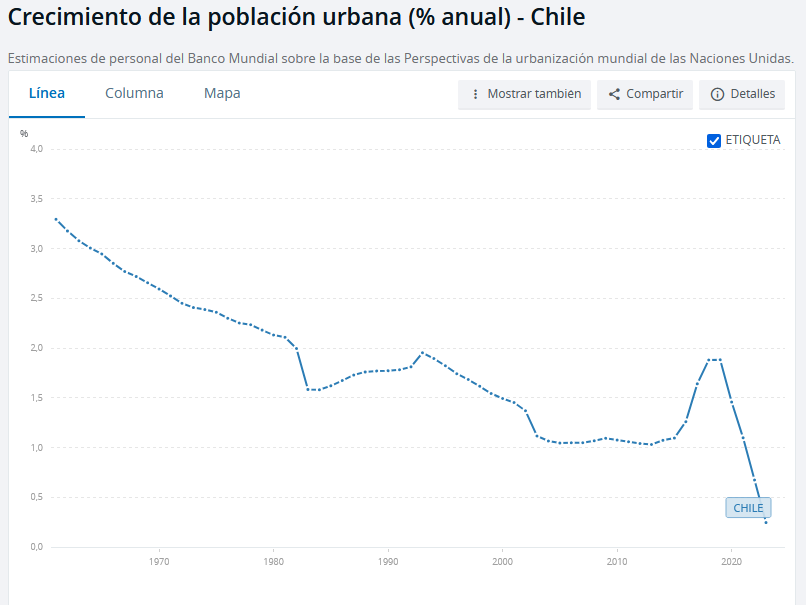
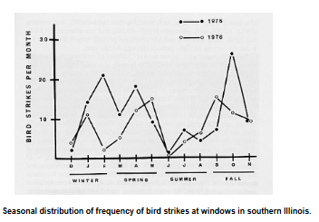

> "Algo que también es evidente y que es provocado por la presencia de estructuras diseñadas por el hombre, son las colisiones que varias especies de aves tienen contra las ventanas de los edificios. Estos eventos son relativamente comunes, por lo que se ha llegado a establecer “que una de las mayores amenazas modernas contra las poblaciones de aves son las ventanas” y las cuales representan “la tercera causa de mortandad de aves relacionadas por actividades humanas” (Leahy 1982, Gill 1995)" ([Baños, 2009, p. 63](zotero://select/library/items/GTW6Z6A5)) ([pdf](zotero://open-pdf/library/items/5UY84NZ3?page=3))
- buscar cartografias mayores elevaciones arquitectonicas de la ciudad
- ir a esperara a un pajaro frente al ventanal del ultimo piso de un edificio

- acertivxs entre el fin del invierno e inicio de primavera, y al inicio de verano
-  