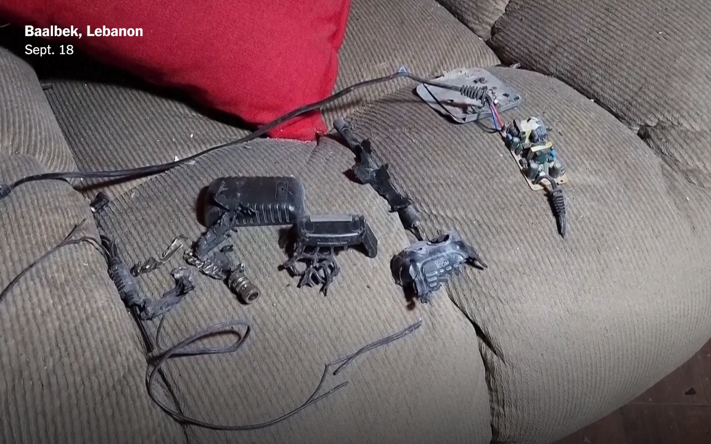
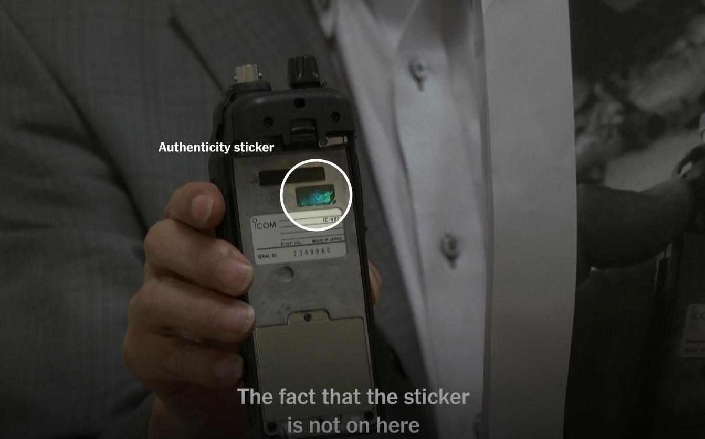
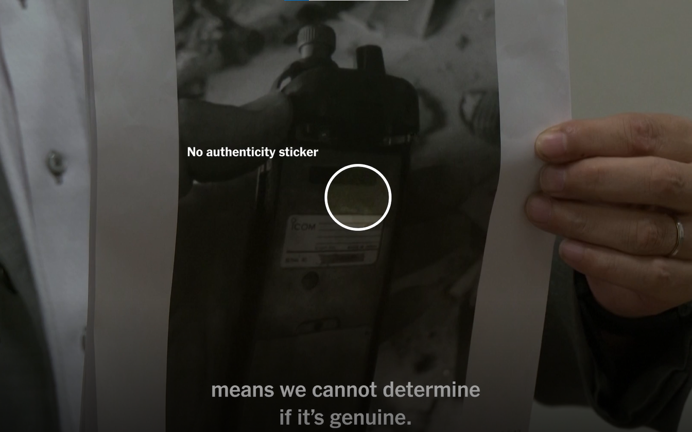
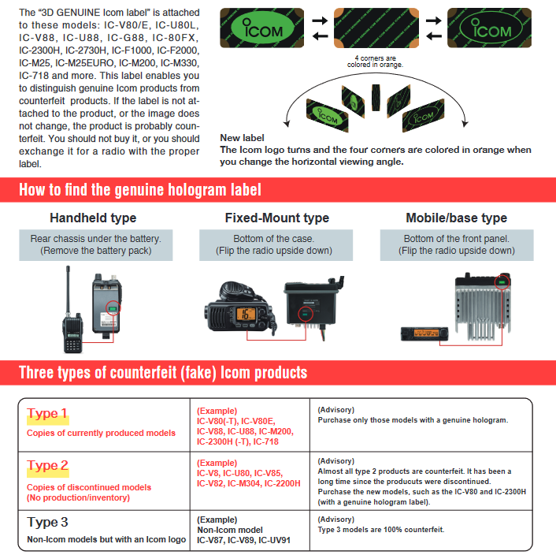

# Playa de ratas
## Repositorio de artes de escritura y registro

<blockquote>
…ya no se trata de precisar cómo la violencia del orden se transforma en tecnología disciplinaria, sino de exhumar las formas subrepticias que adquiere la creatividad dispersa, táctica y artesanal de grupos o individuos atrapados en lo sucesivo dentro de las redes de la “vigilancia”.
 <cite>Michel de Certeau, La invención de lo cotidiano</cite>
</blockquote>
  

### Invitación

titulo

Esta es una _invitación_ a ensayar/intentar/inventar formas de registro que permitan informar sobre procesos en despliegue, hilvanar una serie de pensares, habitares que hace rato dan vuelta, o se amontonan en libretas, digitales o en papel; quizás, otro camino puede ser afrontar esta invitación escritural como un proceso en sí mismo. Como sea, pensamos en configurar un espacio que permita construir formas propias de _informar_ / compartir sobre lo que desde acá, Temuco, sur del sur, Araucanía/Walmapu, estamos pensando, las formulaciones que desde nuestros habitares estamos ideando, movilizando. Nos preocupa la sostenibilidad, el recuerdo de nuestros gestos, la obsolescencia inmanente que cada objeto y relación con ellos impregna, como un territorio de disputa del registro y la memoria. Desinundarnos de los flujos de apreciación y producción digital de contenidos a partir de los criterios, desesos y ritmos que el neoliberalismo instala en sus aparatos de producción digital, socializada, gratuita, estetizada.

La orientación hacia los contenidos y las practicas de lectura.

Un espacio desinstitucionalizado, autogestionado y desarrollado manualmente. No hay inteligencias artificiales asociadas a ningun procedimiento que permita la existencia digital de este espacio. Toda su infraestructura esta construida sobre **Markdown**. Animamos su uso para la rdacción de colaboraciones. **Pandoc** permite la compilación en HTML y Pdf de cada uno de los contenidos publicados. **P5.js** es el entorno para la creación de animaciones y experimentaciones multimediales. Todo el código y contenidos son de libre acceso a través del repositorio en **GitHub**.

---

"Causar lesiones con explosivos es una cuestión de proximidad". Beepers y walkie-talkies explotando  simultáneamente en zonas comerciales y hospitales. ¿te imaginas? eligiendo unas verduras en el supermercado, y de pronto al frente un tipo cogiendo tomates saca su teléfono, una explosión repentina a la altura de los ojos. Seguro se nos caen las cosas de las manos, no podemos ver, la potencia de la explosión nos nubla el oído, perdemos el equilibrio, trastabillamos intentando fijar la mirada en el origen. No entendemos nada del mundo durante unos segundos. Gritos, sirenas, jugo de fruta y sangre en los labios. Esquirlas en la cara, sangre en los ojos. Ver ya no es importante, ni para quién ataca, ni como límite autoimpuesto, legal o ético, frente a las consecuencias potenciales en el atacado. La deshumanización funciona, el humano la ha configurado como una máquina que extirpa en función de objetivos televisivamente precisos, siempre difusos en los hechos. 

Fabricados en Taiwan y Japón, intervenidos por una compañía adquirida por el Mossad con sede en Budapest, distribuidos por una empresa de Bulgaria, compradas por miembros de Hezbollah en el sur de El Líbano y  Siria;  37 muert+s, 2 niñ+s, 3.000 personas heridas. El cambio tecnológico que implementaban, con llamamientos de jerarcas a enterrar bajo tierra los celulares en cajas metálicas, tenía como objetivo intentar establecer un sistema de comunicación de una vía, y de esta forma impedir la capacidad de triangulación y geolocalización de dispositivos móviles que la tecnología israelita hoy posibilita, sirviéndose del registro  permanente, bidireccional, de nuestros teléfonos con la red de antenas de radiofrecuencias existentes por todo el planeta. Los buscapersonas emitieron un pitido con un falso mensaje de un alto mando; luego se silenciaban antes de explotar. La radio **IC-V82** fabricada por Icom es un transceptor VHF (_Muy Alta Frecuencia_) utilizado para comunicaciones de radioaficionad+s. La compañia hace años advierte de la existencia de falsicaciones de sus modelos y del peligro ante el riesgo de explosión de sus baterías. La empresa aseguró que no fabricaban las radios desde el 2014, las baterías también habían sido descontinuadas. 

1. https://www-theguardian-com.translate.goog/world/2024/sep/19/israeli-front-controlled-manufacturing-process-likeliest-explanation-for-attacks-on-hezbollah?_x_tr_sl=auto&_x_tr_tl=es&_x_tr_hl=es
